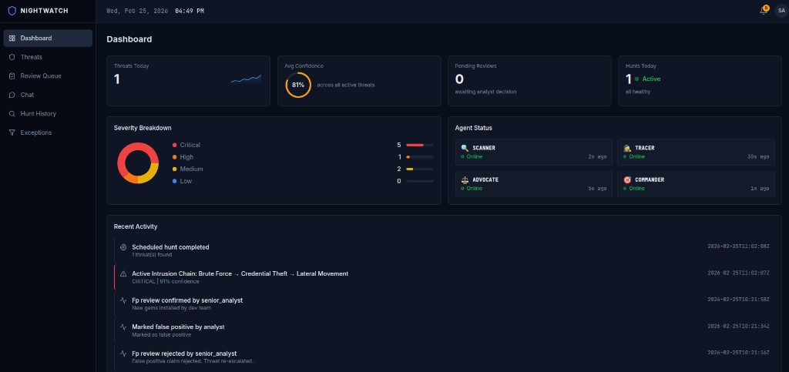
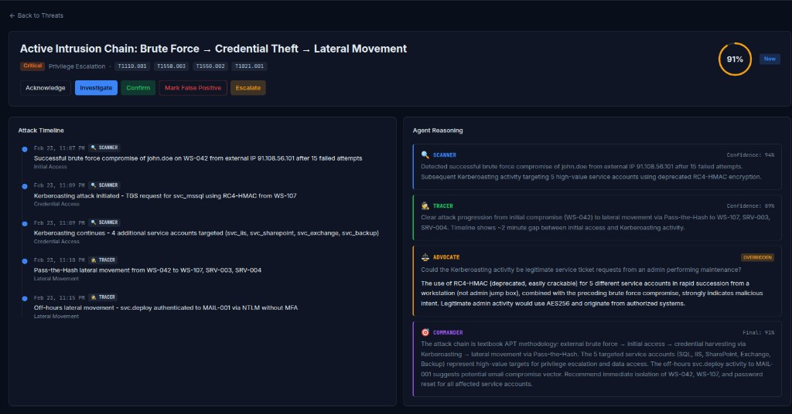
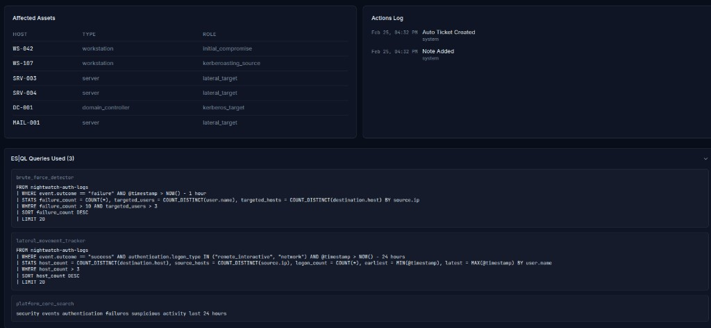
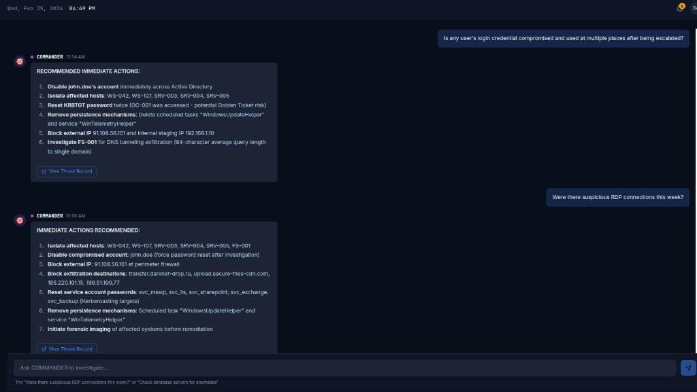
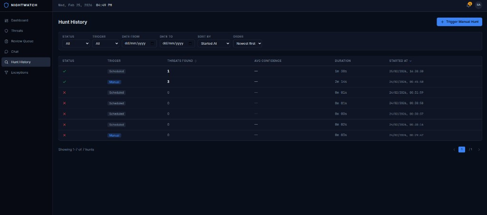
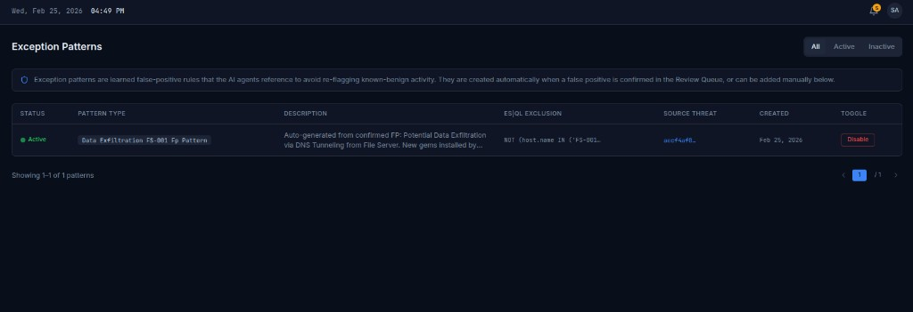
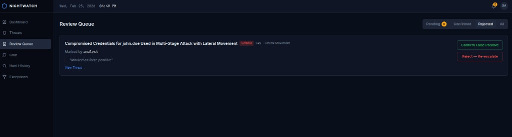

# NIGHTWATCH

**Adversarial Multi-Agent Threat Hunting System**

AI-powered threat hunting with four Elasticsearch Agent Builder agents that hunt for threats, debate their findings, and take automated response actions.

### Screenshots















---

## Features

- **Four-agent adversarial loop:** SCANNER, TRACER, ADVOCATE, and COMMANDER independently analyze security logs and debate findings to reduce false positives
- **Automated hunt cycles** via Sidekiq-Cron; analyst-initiated chat with COMMANDER for ad-hoc investigations
- **Confidence-based routing:** HIGH (70–100%), MEDIUM (40–69%), LOW (0–39%) with simulated response actions for high-confidence threats
- **Dashboard:** threat list, full threat detail with agent reasoning chain, attack timeline, review queue, chat interface, hunt history
- **Real-time updates** via ActionCable WebSocket
- **MCP and A2A integration** for external clients (Claude Desktop, SOAR platforms)
- **MITRE ATT&CK coverage** across initial compromise, lateral movement, privilege escalation, and data exfiltration

---

## Tech Stack

| Layer | Technology |
|-------|------------|
| Backend | Ruby on Rails 7 (API mode), MySQL, Redis, Sidekiq |
| Frontend | React 18, TypeScript, Vite, Tailwind CSS, shadcn/ui, React Query |
| Elasticsearch | Kibana Agent Builder, ES\|QL tools, four indices |

---

## Prerequisites

- Docker and Docker Compose
- Elasticsearch Cloud deployment with Agent Builder (for threat detection)
- Python 3 with `elasticsearch` and `python-dotenv` packages (for sample data generation)

---

## Quick Start

```bash
cp backend/.env.example backend/.env
# Edit backend/.env with your Kibana URL, API key, and agent IDs

docker compose up --build
```

- **App:** http://localhost:8080
- **API:** http://localhost:3000

On first run, the backend runs `db:create` and `db:migrate` automatically.

---

## Environment Variables

Copy `backend/.env.example` to `backend/.env` and configure:

| Variable | Required | Description |
|----------|----------|-------------|
| `KIBANA_URL` | Yes (for agents) | Kibana deployment URL (e.g. `https://YOUR-DEPLOYMENT.kb.us-east-1.aws.elastic.cloud`) |
| `KIBANA_API_KEY` | Yes (for agents) | Base64 API key for Kibana |
| `COMMANDER_AGENT_ID` | Yes | Agent ID from Elastic Agent Builder |
| `SCANNER_AGENT_ID` | Yes | Agent ID for SCANNER agent |
| `TRACER_AGENT_ID` | Yes | Agent ID for TRACER agent |
| `ADVOCATE_AGENT_ID` | Yes | Agent ID for ADVOCATE agent |
| `DB_HOST` | No (Docker sets) | MySQL host; Docker uses `mysql` |
| `DB_PASSWORD` | No (Docker sets) | MySQL root password |
| `REDIS_URL` | No (Docker sets) | Redis URL for Sidekiq and ActionCable |

Docker Compose overrides `DB_HOST`, `DB_PASSWORD`, and `REDIS_URL` automatically.

---

## Data Setup

### Elasticsearch (required for threat detection)

1. **Create indices** in Kibana Dev Tools. See [docs/ELASTICSEARCH_SETUP.md](docs/ELASTICSEARCH_SETUP.md) Section 2 for index mappings.

2. **Generate sample APT attack data:**

```bash
export ES_URL="https://YOUR-DEPLOYMENT.es.REGION.aws.elastic.cloud:443"
export ES_API_KEY="your-base64-api-key"

pip install elasticsearch python-dotenv
python scripts/generate_data.py
```

You can also create a `.env` at the project root with `ES_URL` and `ES_API_KEY`; the script reads them via `load_dotenv()`.

### MySQL

- Migrations run automatically on `docker compose up`.
- Optional: `docker compose run --rm backend bundle exec rails db:seed` (seeds are minimal by default).

---

## Project Structure

```
├── backend/          # Rails 7 API
├── frontend/         # React + Vite
├── scripts/          # Sample data generator (generate_data.py)
└── docs/             # Documentation
```

---

## Documentation

- [docs/PROJECT_OVERVIEW.md](docs/PROJECT_OVERVIEW.md) – Full project narrative
- [docs/ELASTICSEARCH_SETUP.md](docs/ELASTICSEARCH_SETUP.md) – Index creation, ES|QL tools, and agent configuration
