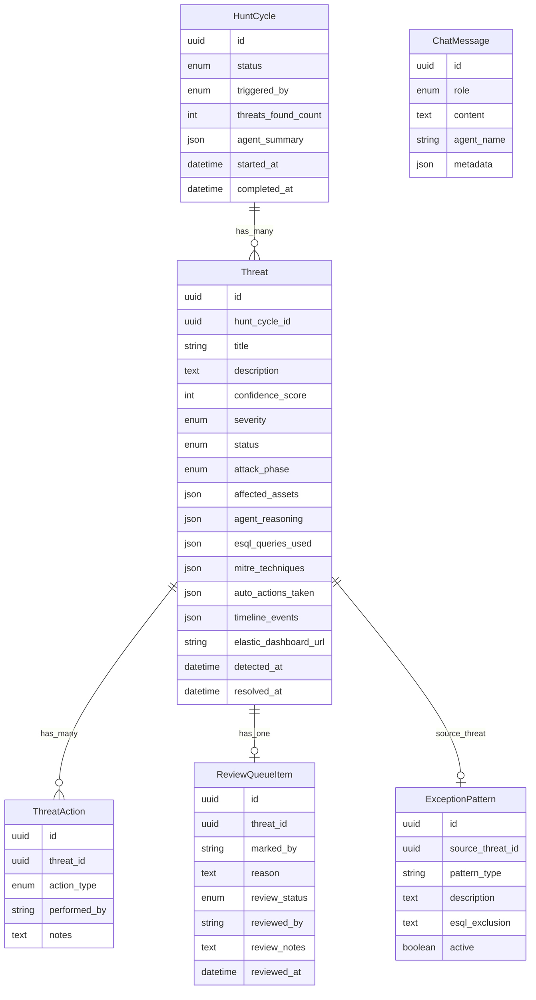

# Backend Architecture

**Stack:** Rails 7.2 (API mode) · MySQL · Sidekiq · ActionCable · Faraday

## Models & Relationships



### Model Purposes

| Model | Purpose |
|-------|---------|
| `HuntCycle` | Represents one automated or manual hunt run. Tracks lifecycle (queued → running → completed/failed) and the agent summary produced by COMMANDER. |
| `Threat` | Core domain model. An AI-detected security threat with full context: severity, MITRE techniques, affected assets, ES\|QL queries that surfaced it, and agent reasoning chain. |
| `ThreatAction` | Immutable audit log of every action taken on a threat, both by humans (acknowledged, investigated, escalated) and automated systems (host isolated, IP blocked, ticket created). |
| `ReviewQueueItem` | Tracks the false-positive review workflow for a threat. Created when an analyst marks a threat as FP; a senior analyst then confirms or rejects. |
| `ExceptionPattern` | A suppression rule derived from a confirmed false positive. Contains an ES\|QL exclusion clause that prevents the same pattern from being re-flagged in future hunts. Optionally linked back to the source threat. |
| `ChatMessage` | Stores the full conversation history between users and the COMMANDER agent for context continuity and audit. |

---

## Services

| Service | Responsibility |
|---------|----------------|
| `KibanaAgentService` | HTTP client (Faraday) that drives AI agents via the Kibana Agent Builder REST API. Sends hunt prompts and chat messages; returns agent responses. |
| `HuntOrchestratorService` | Orchestrates a complete hunt cycle: creates a `HuntCycle`, calls `KibanaAgentService`, parses the response, creates `Threat` records via `ThreatBuilderService`, and triggers auto-actions. |
| `ThreatBuilderService` | Parses the markdown-wrapped JSON that COMMANDER returns and upserts `Threat` records into the database. |
| `FalsePositiveService` | Manages the FP lifecycle: mark as FP → create `ReviewQueueItem` → senior confirms or rejects → create `ExceptionPattern` if confirmed → enqueue ES sync. |
| `SlackNotifierService` | Sends Slack Block Kit alert messages for new high-severity threats, including action buttons for quick analyst response. |

---

## Background Jobs

| Job | Queue | Schedule | Purpose |
|-----|-------|----------|---------|
| `HuntCycleJob` | critical | Every 15 min (cron) | Runs `HuntOrchestratorService` for scheduled hunts |
| `AutoActionsJob` | default | On-demand | Simulates automated responses (isolate host, block IP, create ticket) |
| `SlackNotificationJob` | default | On-demand | Sends threat alerts via `SlackNotifierService` |
| `SlackInteractionJob` | default | On-demand | Processes Slack button callbacks asynchronously (keeps 3-second Slack deadline) |
| `SyncExceptionToElasticsearchJob` | low | On-demand | (Stub) Syncs confirmed `ExceptionPattern` to Elasticsearch |
| `FalsePositiveAnalysisJob` | low | Daily 2 AM (cron) | Runs recurring FP pattern analysis |

---

## Elasticsearch / Kibana API Usage

The application does **not** use the Elasticsearch Ruby client directly. All Elasticsearch interaction goes through the **Kibana Agent Builder REST API**.

### `KibanaAgentService` — Primary Integration

**File:** `app/services/kibana_agent_service.rb`

This is the core integration point. It calls the Kibana Agent Builder API to run AI agents that perform threat hunting by executing ES\|QL queries against the Elasticsearch data tier.

```
POST /api/agent_builder/chat/{agent_id}
```

- **Authentication:** `KIBANA_API_KEY` header
- **Base URL:** `KIBANA_URL` environment variable
- **Agents invoked:**

  | Agent ID env var | Role |
  |-----------------|------|
  | `COMMANDER_AGENT_ID` | Orchestrator; directs the hunt and synthesises findings |
  | `SCANNER_AGENT_ID` | Runs broad ES\|QL queries to surface anomalies |
  | `TRACER_AGENT_ID` | Deep-dives on specific indicators |
  | `ADVOCATE_AGENT_ID` | Challenges findings to reduce false positives |

- **Methods exposed:**
  - `start_hunt(message)` — sends a structured hunt prompt to COMMANDER
  - `send_message(agent, message, conversation_id:)` — generic agent invocation
  - `chat(user_message, conversation_id:)` — ad-hoc COMMANDER conversation for the Chat UI

### `SyncExceptionToElasticsearchJob` — Planned Integration (Stub)

**File:** `app/jobs/sync_exception_to_elasticsearch_job.rb`

Triggered by `FalsePositiveService#confirm_false_positive` after a senior analyst confirms an FP. Currently logs only; the intended behaviour is to index the confirmed `ExceptionPattern` into a `nightwatch-exception-patterns` Elasticsearch index so the hunting agents can use it to exclude known benign patterns from future hunts.

---

## Real-time Updates (ActionCable)

`FrontendUpdatesChannel` is the single WebSocket channel. Models and jobs broadcast to it with a `topic` and optional `query_key`. The frontend uses the `query_key` to call `queryClient.invalidateQueries()` and refresh the relevant React Query cache — no polling required.
