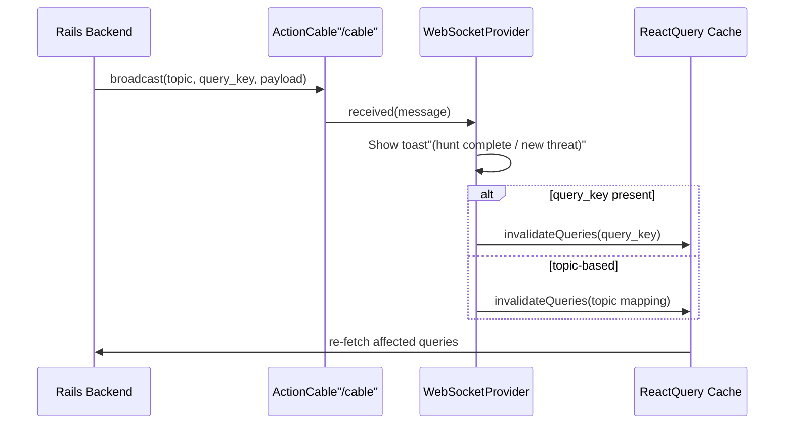

# Frontend Architecture

**Stack:** React 18 · Vite · TypeScript · React Router v6 · React Query · shadcn/ui · Tailwind CSS · ActionCable

---

## Pages & Routes

All routes are wrapped in the `Layout` component (collapsible sidebar + header). The `NotFound` page is the only route rendered without it.

| Route | Page | Description |
|-------|------|-------------|
| `/` | `Index` | Dashboard — aggregate stats, severity pie chart, agent status, recent activity feed |
| `/threats` | `Threats` | Threat list with filters (status, severity, confidence range, date range, free-text search) |
| `/threats/:id` | `ThreatDetail` | Full threat detail — agent reasoning chain, timeline, affected assets, action history, ES\|QL queries panel |
| `/review` | `ReviewQueue` | False-positive review queue — confirm or reject FP assessments with optional notes |
| `/chat` | `Chat` | Interactive chat with the COMMANDER agent; ability to promote a message to a formal threat |
| `/hunts` | `HuntHistory` | Paginated list of past and running hunt cycles |
| `/exceptions` | `ExceptionPatterns` | Exception patterns table with active/inactive toggle |
| `*` | `NotFound` | 404 fallback |

---

## Application Structure

```
frontend/src/
├── App.tsx                  # Router definition, QueryClient, WebSocketProvider
├── main.tsx                 # React DOM entry point
├── index.css                # Tailwind base styles
├── components/
│   ├── Layout.tsx           # App shell: sidebar navigation + header
│   ├── NavLink.tsx          # react-router NavLink with active/pending styles
│   ├── WebSocketProvider.tsx # ActionCable connection + React Query invalidation
│   ├── ESQLQueriesPanel.tsx  # Collapsible ES|QL query display on ThreatDetail
│   ├── ReviewModal.tsx       # Dialog for confirm/reject FP on ReviewQueue
│   └── ui/                  # shadcn/ui primitives (button, card, dialog, table, etc.)
├── hooks/                   # React Query hooks — one file per resource
├── lib/
│   ├── api.ts               # Fetch wrapper with error handling
│   └── utils.ts             # Tailwind class merge utility (cn)
├── pages/                   # One file per route
└── types/
    └── index.ts             # All shared TypeScript types
```

---

## API Layer

All API calls go through `src/lib/api.ts`, which wraps `fetch` with:
- `Content-Type: application/json` and `Accept: application/json` headers
- Throws `ApiError` (with status code + message) for non-2xx responses
- Returns `null` for 204 No Content

**Base URL:** `/api/v1` (proxied to the Rails backend by Vite in development)

### Hooks

Each hook file in `src/hooks/` exports React Query `useQuery` / `useMutation` wrappers. Mutations automatically invalidate the relevant query keys on success.

| Hook | Method | Endpoint | Purpose |
|------|--------|----------|---------|
| `useThreats` | GET | `/threats` | Paginated, filtered threat list |
| `useThreat` | GET | `/threats/:id` | Single threat detail |
| `useUpdateThreat` | PATCH | `/threats/:id` | Update threat status |
| `useCreateThreatAction` | POST | `/threats/:id/actions` | Record a manual action on a threat |
| `useChatHistory` | GET | `/chat/history` | Full COMMANDER conversation history |
| `useSendChatMessage` | POST | `/chat` | Send a message to COMMANDER |
| `useCreateThreatFromChat` | POST | `/chat/create_threat` | Promote a chat message to a threat |
| `useDashboardStats` | GET | `/dashboard/stats` | Aggregate stats (auto-refetch every 30s) |
| `useActivityFeed` | GET | `/dashboard/activity_feed` | Recent activity feed (auto-refetch every 30s) |
| `useHunts` | GET | `/hunts` | Paginated hunt cycle list |
| `useTriggerHunt` | POST | `/hunts` | Manually trigger a new hunt |
| `useReviewQueue` | GET | `/review_queue` | FP review queue with status filter |
| `useReviewAction` | PATCH | `/review_queue/:id` | Confirm or reject a review item |
| `useExceptionPatterns` | GET | `/exception_patterns` | Exception patterns list |

---

## TypeScript Types (`src/types/index.ts`)

### Core Domain Types

| Type | Description |
|------|-------------|
| `Threat` | Full threat record matching the backend model — severity, status, confidence, assets, MITRE, timeline, ES\|QL queries, agent reasoning |
| `HuntCycle` | Hunt run record with status, trigger type, and threat count |
| `ThreatAction` | Single audit log entry for an action taken on a threat |
| `ReviewQueueItem` | FP review record with status and reviewer details |
| `ExceptionPattern` | Suppression rule with ES\|QL exclusion clause |
| `ChatMessage` | A single message in the COMMANDER conversation (role: user \| agent) |
| `DashboardStats` | Aggregate counts and metrics for the dashboard |
| `ActivityFeedItem` | A single entry in the dashboard activity feed |

### Nested / Embedded Types

| Type | Lives inside | Description |
|------|-------------|-------------|
| `AgentReasoning` | `Threat` | Full reasoning chain from the four AI agents |
| `AgentFinding` | `AgentReasoning` | A single agent's findings and confidence |
| `AdvocateChallenge` | `AgentReasoning` | ADVOCATE agent's counter-arguments |
| `CommanderVerdict` | `AgentReasoning` | COMMANDER's final synthesis |
| `ESQLQuery` | `Threat` | An ES\|QL query used during the hunt, with its results |
| `TimelineEvent` | `Threat` | A timestamped event in the threat timeline |
| `AutoAction` | `Threat` | An automated response action taken by the system |
| `Asset` | `Threat` | A host or user affected by the threat |

### Filter Types

| Type | Used by | Fields |
|------|---------|--------|
| `ThreatFilters` | `useThreats` | status, severity, confidence\_min/max, date\_from/to, search, sort\_by, sort\_order, page, per\_page |
| `ReviewFilters` | `useReviewQueue` | review\_status, page, per\_page |
| `HuntFilters` | `useHunts` | page, per\_page |

### API Response Wrappers

All list endpoints return a `{ data, meta }` envelope. The `meta` field is typed as `PaginationMeta` (current\_page, total\_pages, total\_count, per\_page).

---

## Real-time Updates (WebSocket)



`WebSocketProvider` (`src/components/WebSocketProvider.tsx`) wraps the entire app. On mount it connects to `/cable` (or `VITE_CABLE_URL`) and subscribes to `FrontendUpdatesChannel`.

**On each received message:**
1. If the `topic` is `hunt_status_changed` (completed/failed) or `new_threat`, a Sonner toast is shown.
2. If the payload carries a `query_key`, React Query invalidates that specific key.
3. Otherwise, the topic is mapped to a cache key (`threats`, `dashboard`, `chat`, `review_queue`, `hunts`) and that key is invalidated.

This means the UI stays live without polling — the backend drives cache invalidation through WebSocket events.
