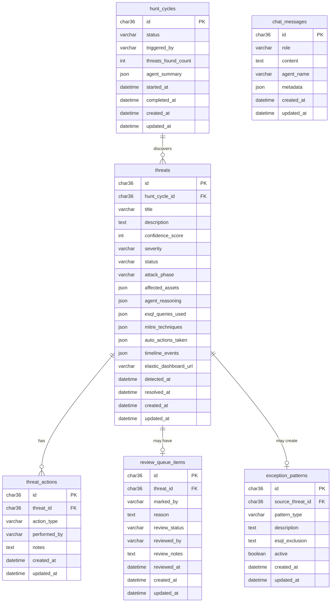

# NIGHTWATCH -- Low-Level Design

**Engineering Blueprint: Data Models, Services, Jobs, and API Contracts**

---

## Table of Contents

1. [MySQL Database Schema](#1-mysql-database-schema)
2. [Rails Models and Enums](#2-rails-models-and-enums)
3. [Service Objects](#3-service-objects)
4. [Sidekiq Jobs](#4-sidekiq-jobs)
5. [API Endpoints -- Full Contract](#5-api-endpoints----full-contract)
6. [ActionCable Channels](#6-actioncable-channels)
7. [Frontend Component Tree](#7-frontend-component-tree)

---

## 1. MySQL Database Schema

### 1.1 Entity-Relationship Diagram



### 1.2 Table: `hunt_cycles`

Tracks every automated and manual hunt run.

```sql
CREATE TABLE hunt_cycles (
  id CHAR(36) NOT NULL PRIMARY KEY,
  status VARCHAR(20) NOT NULL DEFAULT 'queued',
    -- ENUM: 'queued', 'running', 'completed', 'failed'
  triggered_by VARCHAR(20) NOT NULL DEFAULT 'scheduled',
    -- ENUM: 'scheduled', 'manual'
  threats_found_count INT NOT NULL DEFAULT 0,
  agent_summary JSON,
    -- {
    --   scanner: { events_scanned: 12400, suspicious_found: 7 },
    --   tracer:   { paths_traced: 3, assets_involved: 12 },
    --   advocate: { challenges_raised: 2, challenges_upheld: 1 },
    --   commander: { final_threats: 2, avg_confidence: 78 }
    -- }
  started_at DATETIME,
  completed_at DATETIME,
  created_at DATETIME NOT NULL,
  updated_at DATETIME NOT NULL,

  INDEX idx_hunt_cycles_status (status),
  INDEX idx_hunt_cycles_started_at (started_at)
) ENGINE=InnoDB DEFAULT CHARSET=utf8mb4;
```

### 1.3 Table: `threats`

The core entity. Every detected threat is a row here.

```sql
CREATE TABLE threats (
  id CHAR(36) NOT NULL PRIMARY KEY,
  hunt_cycle_id CHAR(36),
    -- NULL if created manually from chat
  title VARCHAR(255) NOT NULL,
  description TEXT NOT NULL,
  confidence_score INT NOT NULL DEFAULT 0,
    -- 0 to 100
  severity VARCHAR(20) NOT NULL DEFAULT 'medium',
    -- ENUM: 'critical', 'high', 'medium', 'low'
  status VARCHAR(30) NOT NULL DEFAULT 'new',
    -- ENUM: 'new', 'investigating', 'confirmed',
    --       'false_positive_pending', 'false_positive_confirmed',
    --       'escalated', 'resolved'
  attack_phase VARCHAR(30),
    -- ENUM: 'initial_compromise', 'lateral_movement',
    --       'privilege_escalation', 'data_exfiltration',
    --       'persistence', 'multi_phase'
  affected_assets JSON,
    -- [
    --   { "host": "WS-042", "type": "workstation", "role": "initial_compromise" },
    --   { "host": "SRV-003", "type": "server", "role": "lateral_target" }
    -- ]
  agent_reasoning JSON,
    -- {
    --   scanner: { finding: "...", confidence: 88, evidence: [...] },
    --   tracer:   { finding: "...", confidence: 91, evidence: [...] },
    --   advocate: { challenge: "...", upheld: false, reason: "..." },
    --   commander: { verdict: "...", final_confidence: 92, reasoning: "..." }
    -- }
  esql_queries_used JSON,
    -- [
    --   { "tool": "brute_force_detector", "query": "FROM nightwatch-auth-logs | ..." },
    --   { "tool": "lateral_movement_tracker", "query": "FROM nightwatch-auth-logs | ..." }
    -- ]
  mitre_techniques JSON,
    -- ["T1110", "T1021.001", "T1003"]
  auto_actions_taken JSON,
    -- [
    --   { "action": "isolate_host", "target": "WS-042", "workflow_id": "wf-123", "status": "completed" },
    --   { "action": "create_ticket", "ticket_id": "INC-2026-0892", "status": "completed" }
    -- ]
  timeline_events JSON,
    -- [
    --   {
    --     "timestamp": "2026-02-07T09:14:00Z",
    --     "description": "Malicious macro executed on WS-042",
    --     "source_agent": "scanner",
    --     "attack_phase": "initial_compromise",
    --     "evidence": { "process": "powershell.exe", "parent": "winword.exe", "command_line": "..." }
    --   }
    -- ]
  elastic_dashboard_url VARCHAR(512),
  detected_at DATETIME NOT NULL,
  resolved_at DATETIME,
  created_at DATETIME NOT NULL,
  updated_at DATETIME NOT NULL,

  INDEX idx_threats_status (status),
  INDEX idx_threats_severity (severity),
  INDEX idx_threats_confidence (confidence_score),
  INDEX idx_threats_detected_at (detected_at),
  INDEX idx_threats_hunt_cycle (hunt_cycle_id),
  INDEX idx_threats_attack_phase (attack_phase),

  CONSTRAINT fk_threats_hunt_cycle
    FOREIGN KEY (hunt_cycle_id) REFERENCES hunt_cycles(id)
    ON DELETE SET NULL
) ENGINE=InnoDB DEFAULT CHARSET=utf8mb4;
```

### 1.4 Table: `threat_actions`

Audit trail. Every action on a threat (by system or human) is recorded here.

```sql
CREATE TABLE threat_actions (
  id CHAR(36) NOT NULL PRIMARY KEY,
  threat_id CHAR(36) NOT NULL,
  action_type VARCHAR(30) NOT NULL,
    -- ENUM: 'acknowledged', 'investigating', 'confirmed',
    --       'marked_false_positive', 'escalated', 'resolved',
    --       'auto_isolated', 'auto_blocked', 'auto_ticket_created',
    --       'note_added', 'fp_review_confirmed', 'fp_review_rejected'
  performed_by VARCHAR(255) NOT NULL,
    -- email address or 'system'
  notes TEXT,
  created_at DATETIME NOT NULL,
  updated_at DATETIME NOT NULL,

  INDEX idx_threat_actions_threat (threat_id),
  INDEX idx_threat_actions_type (action_type),
  INDEX idx_threat_actions_created (created_at),

  CONSTRAINT fk_threat_actions_threat
    FOREIGN KEY (threat_id) REFERENCES threats(id)
    ON DELETE CASCADE
) ENGINE=InnoDB DEFAULT CHARSET=utf8mb4;
```

### 1.5 Table: `review_queue_items`

Holds threats marked as false positive that need senior review.

```sql
CREATE TABLE review_queue_items (
  id CHAR(36) NOT NULL PRIMARY KEY,
  threat_id CHAR(36) NOT NULL,
  marked_by VARCHAR(255) NOT NULL,
    -- email of analyst who marked it as FP
  reason TEXT NOT NULL,
    -- analyst's explanation of why it's a false positive
  review_status VARCHAR(20) NOT NULL DEFAULT 'pending',
    -- ENUM: 'pending', 'confirmed_fp', 'rejected_fp'
  reviewed_by VARCHAR(255),
    -- email of senior analyst who reviewed
  review_notes TEXT,
  reviewed_at DATETIME,
  created_at DATETIME NOT NULL,
  updated_at DATETIME NOT NULL,

  INDEX idx_review_queue_status (review_status),
  INDEX idx_review_queue_threat (threat_id),

  CONSTRAINT fk_review_queue_threat
    FOREIGN KEY (threat_id) REFERENCES threats(id)
    ON DELETE CASCADE
) ENGINE=InnoDB DEFAULT CHARSET=utf8mb4;
```

### 1.6 Table: `exception_patterns`

Learned false positive patterns that agents reference to avoid repeating mistakes.

```sql
CREATE TABLE exception_patterns (
  id CHAR(36) NOT NULL PRIMARY KEY,
  source_threat_id CHAR(36),
    -- the threat that led to creating this exception (NULL if manual)
  pattern_type VARCHAR(100) NOT NULL,
    -- e.g., 'admin_rdp_pattern', 'scheduled_backup_process', 'vpn_reconnection'
  description TEXT NOT NULL,
    -- human-readable explanation of the exception
  esql_exclusion TEXT,
    -- the ES|QL WHERE clause to exclude this pattern
    -- e.g., "user.name IN ('svc_backup', 'svc_monitoring') AND process.name == 'backup_agent.exe'"
  active BOOLEAN NOT NULL DEFAULT TRUE,
  created_at DATETIME NOT NULL,
  updated_at DATETIME NOT NULL,

  INDEX idx_exception_patterns_active (active),
  INDEX idx_exception_patterns_type (pattern_type),

  CONSTRAINT fk_exception_patterns_threat
    FOREIGN KEY (source_threat_id) REFERENCES threats(id)
    ON DELETE SET NULL
) ENGINE=InnoDB DEFAULT CHARSET=utf8mb4;
```

### 1.7 Table: `chat_messages`

Stores the conversation history between analysts and the COMMANDER agent.

```sql
CREATE TABLE chat_messages (
  id CHAR(36) NOT NULL PRIMARY KEY,
  role VARCHAR(10) NOT NULL,
    -- ENUM: 'user', 'agent'
  content TEXT NOT NULL,
  agent_name VARCHAR(50),
    -- NULL for user messages, 'COMMANDER' for agent responses
  metadata JSON,
    -- {
    --   tool_calls: [{ tool: "lateral_movement_tracker", result_count: 5 }],
    --   confidence: 72,
    --   processing_time_ms: 3400
    -- }
  created_at DATETIME NOT NULL,
  updated_at DATETIME NOT NULL,

  INDEX idx_chat_messages_role (role),
  INDEX idx_chat_messages_created (created_at)
) ENGINE=InnoDB DEFAULT CHARSET=utf8mb4;
```

---

## 2. Rails Models and Enums

### 2.1 HuntCycle Model

```ruby
# app/models/hunt_cycle.rb
class HuntCycle < ApplicationRecord
  # -- Associations --
  has_many :threats, dependent: :nullify

  # -- Enums --
  enum :status, {
    queued:    'queued',
    running:   'running',
    completed: 'completed',
    failed:    'failed'
  }

  enum :triggered_by, {
    scheduled: 'scheduled',
    manual:    'manual'
  }, prefix: true

  # -- Validations --
  validates :status, presence: true
  validates :triggered_by, presence: true

  # -- Scopes --
  scope :recent, -> { order(started_at: :desc) }
  scope :today, -> { where(started_at: Time.current.beginning_of_day..) }

  # -- Callbacks --
  before_create :set_uuid
  after_update :broadcast_status_change, if: :saved_change_to_status?

  private

  def set_uuid
    self.id ||= SecureRandom.uuid
  end

  def broadcast_status_change
    ActionCable.server.broadcast('hunts_channel', {
      type: 'hunt_status_changed',
      hunt: HuntCycleSerializer.new(self).as_json
    })
  end
end
```

### 2.2 Threat Model

```ruby
# app/models/threat.rb
class Threat < ApplicationRecord
  # -- Associations --
  belongs_to :hunt_cycle, optional: true
  has_many :threat_actions, dependent: :destroy
  has_one :review_queue_item, dependent: :destroy
  has_one :exception_pattern, foreign_key: :source_threat_id, dependent: :nullify

  # -- Enums --
  enum :severity, {
    critical: 'critical',
    high:     'high',
    medium:   'medium',
    low:      'low'
  }

  enum :status, {
    new_threat:              'new',
    investigating:           'investigating',
    confirmed:               'confirmed',
    false_positive_pending:  'false_positive_pending',
    false_positive_confirmed:'false_positive_confirmed',
    escalated:               'escalated',
    resolved:                'resolved'
  }

  enum :attack_phase, {
    initial_compromise:    'initial_compromise',
    lateral_movement:      'lateral_movement',
    privilege_escalation:  'privilege_escalation',
    data_exfiltration:     'data_exfiltration',
    persistence:           'persistence',
    multi_phase:           'multi_phase'
  }, prefix: true

  # -- Validations --
  validates :title, presence: true
  validates :description, presence: true
  validates :confidence_score, presence: true,
            numericality: { in: 0..100 }
  validates :severity, presence: true
  validates :status, presence: true
  validates :detected_at, presence: true

  # -- Scopes --
  scope :recent, -> { order(detected_at: :desc) }
  scope :today, -> { where(detected_at: Time.current.beginning_of_day..) }
  scope :high_severity, -> { where(severity: ['critical', 'high']) }
  scope :actionable, -> { where(status: ['new', 'investigating', 'escalated']) }
  scope :pending_review, -> { where(status: 'false_positive_pending') }
  scope :by_confidence, -> { order(confidence_score: :desc) }

  # -- Callbacks --
  before_create :set_uuid
  after_create :broadcast_new_threat
  after_update :broadcast_status_change, if: :saved_change_to_status?

  # -- Methods --
  def high_confidence?
    confidence_score >= 70
  end

  def medium_confidence?
    confidence_score.between?(40, 69)
  end

  def low_confidence?
    confidence_score < 40
  end

  def severity_label
    severity.upcase
  end

  private

  def set_uuid
    self.id ||= SecureRandom.uuid
  end

  def broadcast_new_threat
    ActionCable.server.broadcast('threats_channel', {
      type: 'new_threat',
      threat: ThreatSerializer.new(self).as_json
    })
  end

  def broadcast_status_change
    ActionCable.server.broadcast('threats_channel', {
      type: 'threat_updated',
      threat: ThreatSerializer.new(self).as_json
    })
  end
end
```

### 2.3 ThreatAction Model

```ruby
# app/models/threat_action.rb
class ThreatAction < ApplicationRecord
  # -- Associations --
  belongs_to :threat

  # -- Enums --
  enum :action_type, {
    acknowledged:         'acknowledged',
    investigating:        'investigating',
    confirmed:            'confirmed',
    marked_false_positive:'marked_false_positive',
    escalated:            'escalated',
    resolved:             'resolved',
    auto_isolated:        'auto_isolated',
    auto_blocked:         'auto_blocked',
    auto_ticket_created:  'auto_ticket_created',
    note_added:           'note_added',
    fp_review_confirmed:  'fp_review_confirmed',
    fp_review_rejected:   'fp_review_rejected'
  }

  # -- Validations --
  validates :action_type, presence: true
  validates :performed_by, presence: true

  # -- Scopes --
  scope :recent, -> { order(created_at: :desc) }
  scope :by_system, -> { where(performed_by: 'system') }
  scope :by_humans, -> { where.not(performed_by: 'system') }

  # -- Callbacks --
  before_create :set_uuid

  private

  def set_uuid
    self.id ||= SecureRandom.uuid
  end
end
```

### 2.4 ReviewQueueItem Model

```ruby
# app/models/review_queue_item.rb
class ReviewQueueItem < ApplicationRecord
  # -- Associations --
  belongs_to :threat

  # -- Enums --
  enum :review_status, {
    pending:      'pending',
    confirmed_fp: 'confirmed_fp',
    rejected_fp:  'rejected_fp'
  }

  # -- Validations --
  validates :marked_by, presence: true
  validates :reason, presence: true
  validates :review_status, presence: true

  # -- Scopes --
  scope :pending_review, -> { where(review_status: 'pending') }
  scope :recent, -> { order(created_at: :desc) }

  # -- Callbacks --
  before_create :set_uuid

  private

  def set_uuid
    self.id ||= SecureRandom.uuid
  end
end
```

### 2.5 ExceptionPattern Model

```ruby
# app/models/exception_pattern.rb
class ExceptionPattern < ApplicationRecord
  # -- Associations --
  belongs_to :source_threat, class_name: 'Threat', optional: true

  # -- Validations --
  validates :pattern_type, presence: true
  validates :description, presence: true

  # -- Scopes --
  scope :active, -> { where(active: true) }
  scope :inactive, -> { where(active: false) }
  scope :by_type, ->(type) { where(pattern_type: type) }

  # -- Callbacks --
  before_create :set_uuid

  private

  def set_uuid
    self.id ||= SecureRandom.uuid
  end
end
```

### 2.6 ChatMessage Model

```ruby
# app/models/chat_message.rb
class ChatMessage < ApplicationRecord
  # -- Enums --
  enum :role, {
    user:  'user',
    agent: 'agent'
  }

  # -- Validations --
  validates :role, presence: true
  validates :content, presence: true

  # -- Scopes --
  scope :recent, -> { order(created_at: :desc) }
  scope :chronological, -> { order(created_at: :asc) }

  # -- Callbacks --
  before_create :set_uuid
  after_create :broadcast_message

  private

  def set_uuid
    self.id ||= SecureRandom.uuid
  end

  def broadcast_message
    ActionCable.server.broadcast('chat_channel', {
      type: 'new_message',
      message: ChatMessageSerializer.new(self).as_json
    })
  end
end
```

---

## 3. Service Objects

### 3.1 KibanaAgentService

Handles all communication with Elasticsearch Agent Builder via the Kibana REST API.

```ruby
# app/services/kibana_agent_service.rb
class KibanaAgentService
  BASE_URL = ENV.fetch('KIBANA_URL')       # e.g., "https://your-deployment.kb.us-east-1.aws.elastic.cloud"
  API_KEY  = ENV.fetch('KIBANA_API_KEY')   # Base64-encoded API key

  AGENT_IDS = {
    commander: ENV.fetch('COMMANDER_AGENT_ID'),
    scanner:  ENV.fetch('SCANNER_AGENT_ID'),
    tracer:    ENV.fetch('TRACER_AGENT_ID'),
    advocate:  ENV.fetch('ADVOCATE_AGENT_ID')
  }.freeze

  def initialize
    @connection = Faraday.new(url: BASE_URL) do |f|
      f.request :json
      f.response :json
      f.headers['Authorization'] = "ApiKey #{API_KEY}"
      f.headers['kbn-xsrf'] = 'true'
      f.headers['Content-Type'] = 'application/json'
    end
  end

  # Start a threat hunting conversation with the COMMANDER agent.
  # Returns a conversation_id and the initial response.
  #
  # @param message [String] The hunt instruction or query
  # @return [Hash] { conversation_id:, response:, raw: }
  def start_hunt(message = nil)
    message ||= default_hunt_prompt
    send_message(:commander, message)
  end

  # Send a chat message to a specific agent.
  #
  # @param agent [Symbol] :commander, :scanner, :tracer, or :advocate
  # @param message [String] The message to send
  # @param conversation_id [String, nil] Existing conversation ID to continue
  # @return [Hash] { conversation_id:, response:, raw: }
  def send_message(agent, message, conversation_id: nil)
    agent_id = AGENT_IDS.fetch(agent)
    body = {
      message: message
    }
    body[:conversation_id] = conversation_id if conversation_id

    response = @connection.post("/api/agent_builder/chat/#{agent_id}") do |req|
      req.body = body
    end

    raise AgentCommunicationError, "Agent #{agent} returned #{response.status}: #{response.body}" unless response.success?

    parsed = response.body
    {
      conversation_id: parsed['conversation_id'],
      response: parsed['message'] || parsed['content'],
      raw: parsed
    }
  end

  # Send a message to COMMANDER for ad-hoc investigation via chat.
  #
  # @param user_message [String] The analyst's question
  # @return [Hash] { conversation_id:, response:, raw: }
  def chat(user_message)
    send_message(:commander, user_message)
  end

  private

  def default_hunt_prompt
    <<~PROMPT
      Run a comprehensive threat hunt across all available security logs for the
      last 15 minutes. Use your tools to:

      1. Check for initial compromise indicators (brute force, suspicious process
         execution, unusual authentication patterns)
      2. Look for lateral movement (multi-host authentication, RDP abuse, SMB access)
      3. Detect privilege escalation (credential dumping, token manipulation)
      4. Identify data exfiltration (DNS anomalies, large outbound transfers)

      For each finding, provide:
      - A confidence score (0-100)
      - The affected assets (hosts, users)
      - The attack phase (initial_compromise, lateral_movement, privilege_escalation, data_exfiltration)
      - The MITRE ATT&CK technique ID
      - The timeline of events
      - Your reasoning

      Then challenge your own findings: could any of these be false positives?
      What legitimate business reasons could explain the activity?

      Provide your final assessment with an overall confidence score and recommended actions.
    PROMPT
  end
end

class AgentCommunicationError < StandardError; end
```

### 3.2 ThreatBuilderService

Transforms raw agent responses into structured Threat records.

```ruby
# app/services/threat_builder_service.rb
class ThreatBuilderService
  # Parse the COMMANDER agent's response and create Threat records.
  #
  # @param hunt_cycle [HuntCycle] The parent hunt cycle
  # @param agent_response [Hash] The parsed agent response from KibanaAgentService
  # @return [Array<Threat>] Created threat records
  def call(hunt_cycle, agent_response)
    threats_data = parse_agent_response(agent_response)
    threats = []

    threats_data.each do |data|
      threat = Threat.create!(
        hunt_cycle: hunt_cycle,
        title: data[:title],
        description: data[:description],
        confidence_score: data[:confidence_score],
        severity: calculate_severity(data[:confidence_score]),
        status: 'new',
        attack_phase: data[:attack_phase],
        affected_assets: data[:affected_assets],
        agent_reasoning: data[:agent_reasoning],
        esql_queries_used: data[:esql_queries_used],
        mitre_techniques: data[:mitre_techniques],
        auto_actions_taken: [],
        timeline_events: data[:timeline_events],
        detected_at: Time.current
      )

      # Create system action for audit trail
      threat.threat_actions.create!(
        action_type: 'note_added',
        performed_by: 'system',
        notes: "Threat detected by NIGHTWATCH hunt cycle #{hunt_cycle.id}"
      )

      threats << threat
    end

    # Update hunt cycle counts
    hunt_cycle.update!(threats_found_count: threats.size)

    threats
  end

  private

  def parse_agent_response(agent_response)
    # The agent response is a natural language string from the COMMANDER.
    # We parse it into structured threat data.
    #
    # In production, the COMMANDER agent is instructed to return JSON-formatted
    # findings. We parse that JSON here. If parsing fails, we fall back to
    # treating the entire response as a single finding.
    raw_text = agent_response[:response]

    begin
      # Attempt to extract JSON from the agent response
      json_match = raw_text.match(/```json\s*(.*?)\s*```/m)
      if json_match
        parsed = JSON.parse(json_match[1], symbolize_names: true)
        return Array.wrap(parsed[:threats] || parsed)
      end
    rescue JSON::ParserError
      # Fall back to wrapping the entire response
    end

    # Fallback: wrap entire response as single threat
    [{
      title: extract_title(raw_text),
      description: raw_text,
      confidence_score: extract_confidence(raw_text),
      attack_phase: extract_attack_phase(raw_text),
      affected_assets: extract_assets(raw_text),
      agent_reasoning: { commander: { finding: raw_text } },
      esql_queries_used: [],
      mitre_techniques: extract_mitre(raw_text),
      timeline_events: []
    }]
  end

  def calculate_severity(confidence)
    case confidence
    when 85..100 then 'critical'
    when 70..84  then 'high'
    when 40..69  then 'medium'
    else              'low'
    end
  end

  def extract_title(text)
    # Extract first meaningful line or sentence
    first_line = text.lines.find { |l| l.strip.length > 10 }
    (first_line || "Threat Detected").strip.truncate(255)
  end

  def extract_confidence(text)
    match = text.match(/confidence[:\s]*(\d+)/i)
    match ? match[1].to_i.clamp(0, 100) : 50
  end

  def extract_attack_phase(text)
    phases = {
      'initial_compromise'   => /initial.?compromise|phishing|brute.?force|credential.?stuff/i,
      'lateral_movement'     => /lateral.?movement|rdp|smb|pivot/i,
      'privilege_escalation' => /privilege.?escalation|mimikatz|credential.?dump|token/i,
      'data_exfiltration'    => /exfiltration|dns.?tunnel|data.?stag/i
    }
    phases.each do |phase, regex|
      return phase if text.match?(regex)
    end
    'multi_phase'
  end

  def extract_assets(text)
    hosts = text.scan(/\b(?:WS|SRV|FS|DB)-\d{3}\b/).uniq
    users = text.scan(/user[:\s]+["']?(\w+\.\w+)["']?/i).flatten.uniq
    hosts.map { |h| { host: h, type: 'unknown' } } +
      users.map { |u| { user: u, type: 'user_account' } }
  end

  def extract_mitre(text)
    text.scan(/T\d{4}(?:\.\d{3})?/).uniq
  end
end
```

### 3.3 SlackNotifierService

Formats and sends Slack Block Kit messages for threat alerts.

```ruby
# app/services/slack_notifier_service.rb
class SlackNotifierService
  CHANNEL = ENV.fetch('SLACK_CHANNEL', '#security-ops')
  DASHBOARD_URL = ENV.fetch('NIGHTWATCH_DASHBOARD_URL', 'http://localhost:3001')

  def initialize
    @client = Slack::Web::Client.new(token: ENV.fetch('SLACK_BOT_TOKEN'))
  end

  # Send a threat alert to Slack.
  #
  # @param threat [Threat] The threat to notify about
  def notify(threat)
    @client.chat_postMessage(
      channel: CHANNEL,
      blocks: build_blocks(threat),
      text: fallback_text(threat) # Fallback for notifications
    )
  end

  private

  def build_blocks(threat)
    severity_emoji = {
      'critical' => ':rotating_light:',
      'high'     => ':warning:',
      'medium'   => ':large_yellow_circle:',
      'low'      => ':information_source:'
    }

    [
      # Header
      {
        type: 'header',
        text: {
          type: 'plain_text',
          text: "NIGHTWATCH THREAT ALERT"
        }
      },
      # Severity + Confidence
      {
        type: 'section',
        fields: [
          {
            type: 'mrkdwn',
            text: "*Severity:* #{severity_emoji[threat.severity]} #{threat.severity.upcase}"
          },
          {
            type: 'mrkdwn',
            text: "*Confidence:* #{threat.confidence_score}%"
          }
        ]
      },
      { type: 'divider' },
      # Title + Description
      {
        type: 'section',
        text: {
          type: 'mrkdwn',
          text: "*#{threat.title}*\n\n#{threat.description.truncate(500)}"
        }
      },
      # Attack Phase + Assets
      {
        type: 'section',
        fields: [
          {
            type: 'mrkdwn',
            text: "*Attack Phase:* #{threat.attack_phase&.humanize}"
          },
          {
            type: 'mrkdwn',
            text: "*Affected Assets:* #{format_assets(threat.affected_assets)}"
          }
        ]
      },
      # MITRE Techniques
      {
        type: 'section',
        text: {
          type: 'mrkdwn',
          text: "*MITRE ATT&CK:* #{(threat.mitre_techniques || []).join(', ')}"
        }
      },
      # Agent Consensus Summary
      {
        type: 'section',
        text: {
          type: 'mrkdwn',
          text: format_agent_consensus(threat.agent_reasoning)
        }
      },
      # Auto-Actions Taken
      {
        type: 'section',
        text: {
          type: 'mrkdwn',
          text: format_auto_actions(threat.auto_actions_taken)
        }
      },
      { type: 'divider' },
      # Action Buttons
      {
        type: 'actions',
        block_id: "threat_actions_#{threat.id}",
        elements: [
          {
            type: 'button',
            text: { type: 'plain_text', text: 'View Full Investigation' },
            url: "#{DASHBOARD_URL}/threats/#{threat.id}",
            style: 'primary'
          },
          {
            type: 'button',
            text: { type: 'plain_text', text: 'Acknowledge' },
            action_id: 'acknowledge_threat',
            value: threat.id
          },
          {
            type: 'button',
            text: { type: 'plain_text', text: 'Mark False Positive' },
            action_id: 'mark_false_positive',
            value: threat.id,
            style: 'danger'
          }
        ]
      }
    ]
  end

  def format_assets(assets)
    return 'None identified' if assets.blank?
    assets.map { |a| a['host'] || a['user'] }.compact.first(5).join(', ')
  end

  def format_agent_consensus(reasoning)
    return '*Agent Consensus:* No reasoning data' if reasoning.blank?

    lines = ["*Agent Consensus:*"]
    %w[scanner tracer advocate commander].each do |agent|
      data = reasoning[agent] || reasoning[agent.to_sym]
      next unless data

      finding = data['finding'] || data[:finding] || data['challenge'] || data[:challenge] || ''
      lines << "  #{agent.upcase}: #{finding.truncate(100)}"
    end
    lines.join("\n")
  end

  def format_auto_actions(actions)
    return '*Auto-Actions:* None' if actions.blank?

    lines = ["*Auto-Actions Taken:*"]
    actions.each do |action|
      status_icon = action['status'] == 'completed' ? ':white_check_mark:' : ':hourglass:'
      lines << "  #{status_icon} #{action['action']&.humanize} - #{action['target']}"
    end
    lines.join("\n")
  end

  def fallback_text(threat)
    "NIGHTWATCH Alert: #{threat.title} | Confidence: #{threat.confidence_score}% | Severity: #{threat.severity.upcase}"
  end
end
```

### 3.4 HuntOrchestratorService

Orchestrates a complete hunt cycle from start to finish.

```ruby
# app/services/hunt_orchestrator_service.rb
class HuntOrchestratorService
  def initialize
    @kibana_service = KibanaAgentService.new
    @threat_builder = ThreatBuilderService.new
  end

  # Execute a full hunt cycle.
  #
  # @param triggered_by [String] 'scheduled' or 'manual'
  # @return [HuntCycle] The completed hunt cycle
  def call(triggered_by: 'scheduled')
    hunt_cycle = HuntCycle.create!(
      status: 'running',
      triggered_by: triggered_by,
      started_at: Time.current
    )

    begin
      # Step 1: Send hunt request to COMMANDER agent
      agent_response = @kibana_service.start_hunt

      # Step 2: Parse response into Threat records
      threats = @threat_builder.call(hunt_cycle, agent_response)

      # Step 3: Handle each threat based on confidence
      threats.each do |threat|
        handle_threat(threat)
      end

      # Step 4: Complete the hunt cycle
      hunt_cycle.update!(
        status: 'completed',
        completed_at: Time.current,
        agent_summary: build_summary(agent_response, threats)
      )

    rescue StandardError => e
      hunt_cycle.update!(
        status: 'failed',
        completed_at: Time.current,
        agent_summary: { error: e.message }
      )
      Rails.logger.error("Hunt cycle #{hunt_cycle.id} failed: #{e.message}")
      raise
    end

    hunt_cycle
  end

  private

  def handle_threat(threat)
    if threat.high_confidence?
      # HIGH confidence: notify via Slack + trigger auto-response
      SlackNotificationJob.perform_async(threat.id)
      # Auto-response workflows are triggered by the COMMANDER agent itself
      # via Elastic Workflow tools. We just track their status.
      WorkflowStatusJob.perform_in(30.seconds, threat.id)
    elsif threat.medium_confidence?
      # MEDIUM confidence: add to review queue silently
      # (No Slack notification, appears on dashboard)
    end
    # LOW confidence: logged only, no action needed
  end

  def build_summary(agent_response, threats)
    {
      threats_found: threats.size,
      high_confidence: threats.count(&:high_confidence?),
      medium_confidence: threats.count(&:medium_confidence?),
      low_confidence: threats.count(&:low_confidence?),
      avg_confidence: threats.any? ? (threats.sum(&:confidence_score) / threats.size) : 0,
      raw_response_preview: agent_response[:response]&.truncate(500)
    }
  end
end
```

### 3.5 FalsePositiveService

Handles false positive marking, review, and exception pattern creation.

```ruby
# app/services/false_positive_service.rb
class FalsePositiveService
  # Mark a threat as a potential false positive.
  # Creates a review queue item for senior review.
  #
  # @param threat [Threat] The threat to mark
  # @param marked_by [String] Email of the analyst
  # @param reason [String] Why the analyst believes it's a FP
  # @return [ReviewQueueItem]
  def mark_as_false_positive(threat, marked_by:, reason:)
    ActiveRecord::Base.transaction do
      # Update threat status
      threat.update!(status: 'false_positive_pending')

      # Create audit trail entry
      threat.threat_actions.create!(
        action_type: 'marked_false_positive',
        performed_by: marked_by,
        notes: reason
      )

      # Create review queue item
      ReviewQueueItem.create!(
        threat: threat,
        marked_by: marked_by,
        reason: reason,
        review_status: 'pending'
      )
    end
  end

  # Senior analyst confirms the false positive.
  # Creates an exception pattern so agents learn from it.
  #
  # @param review_item [ReviewQueueItem]
  # @param reviewed_by [String] Email of the senior analyst
  # @param review_notes [String] Senior analyst's notes
  # @return [ExceptionPattern]
  def confirm_false_positive(review_item, reviewed_by:, review_notes: nil)
    ActiveRecord::Base.transaction do
      threat = review_item.threat

      # Update review queue item
      review_item.update!(
        review_status: 'confirmed_fp',
        reviewed_by: reviewed_by,
        review_notes: review_notes,
        reviewed_at: Time.current
      )

      # Update threat status
      threat.update!(status: 'false_positive_confirmed')

      # Create audit trail entry
      threat.threat_actions.create!(
        action_type: 'fp_review_confirmed',
        performed_by: reviewed_by,
        notes: review_notes || "False positive confirmed by senior review"
      )

      # Create exception pattern for future hunts
      exception = ExceptionPattern.create!(
        source_threat: threat,
        pattern_type: derive_pattern_type(threat),
        description: "Auto-generated from confirmed FP: #{threat.title}. #{review_notes}",
        esql_exclusion: derive_esql_exclusion(threat),
        active: true
      )

      # Sync exception to Elasticsearch threat-intel index
      SyncExceptionToElasticsearchJob.perform_async(exception.id)

      exception
    end
  end

  # Senior analyst rejects the false positive claim.
  # Re-escalates the threat for investigation.
  #
  # @param review_item [ReviewQueueItem]
  # @param reviewed_by [String] Email of the senior analyst
  # @param review_notes [String] Why the FP claim was rejected
  def reject_false_positive(review_item, reviewed_by:, review_notes: nil)
    ActiveRecord::Base.transaction do
      threat = review_item.threat

      # Update review queue item
      review_item.update!(
        review_status: 'rejected_fp',
        reviewed_by: reviewed_by,
        review_notes: review_notes,
        reviewed_at: Time.current
      )

      # Re-escalate the threat
      threat.update!(status: 'investigating')

      # Create audit trail entry
      threat.threat_actions.create!(
        action_type: 'fp_review_rejected',
        performed_by: reviewed_by,
        notes: review_notes || "False positive claim rejected. Threat re-escalated."
      )

      # Re-notify via Slack
      SlackNotificationJob.perform_async(threat.id)
    end
  end

  private

  def derive_pattern_type(threat)
    phase = threat.attack_phase || 'unknown'
    assets = (threat.affected_assets || []).map { |a| a['host'] || a['user'] }.compact
    "#{phase}_#{assets.first || 'general'}_pattern"
  end

  def derive_esql_exclusion(threat)
    # Generate an ES|QL WHERE clause that would exclude this specific pattern
    # This is a best-effort heuristic based on the threat data
    assets = (threat.affected_assets || []).map { |a| a['host'] || a['user'] }.compact
    return nil if assets.empty?

    hosts = assets.select { |a| a.match?(/^(WS|SRV|FS|DB)-/) }
    users = assets.reject { |a| a.match?(/^(WS|SRV|FS|DB)-/) }

    clauses = []
    clauses << "host.name IN (#{hosts.map { |h| "'#{h}'" }.join(', ')})" if hosts.any?
    clauses << "user.name IN (#{users.map { |u| "'#{u}'" }.join(', ')})" if users.any?

    clauses.any? ? "NOT (#{clauses.join(' AND ')})" : nil
  end
end
```

---

## 4. Sidekiq Jobs

### 4.1 HuntCycleJob

```ruby
# app/sidekiq/hunt_cycle_job.rb
class HuntCycleJob
  include Sidekiq::Job

  sidekiq_options queue: 'critical', retry: 3

  # Triggered by Sidekiq-Cron every 15 minutes.
  # Also called manually from the Hunts API.
  #
  # @param triggered_by [String] 'scheduled' or 'manual'
  def perform(triggered_by = 'scheduled')
    orchestrator = HuntOrchestratorService.new
    orchestrator.call(triggered_by: triggered_by)
  end
end
```

**Sidekiq-Cron configuration:**

```yaml
# config/schedule.yml
hunt_cycle:
  cron: '*/15 * * * *'   # Every 15 minutes
  class: 'HuntCycleJob'
  args: ['scheduled']
  queue: 'critical'
  description: 'Periodic threat hunt cycle'
```

### 4.2 SlackNotificationJob

```ruby
# app/sidekiq/slack_notification_job.rb
class SlackNotificationJob
  include Sidekiq::Job

  sidekiq_options queue: 'default', retry: 5

  # Send a Slack notification for a threat.
  #
  # @param threat_id [String] UUID of the threat
  def perform(threat_id)
    threat = Threat.find(threat_id)

    # Only notify for actionable threats
    return unless threat.high_confidence? || threat.escalated?

    notifier = SlackNotifierService.new
    notifier.notify(threat)

    # Record the notification in the audit trail
    threat.threat_actions.create!(
      action_type: 'note_added',
      performed_by: 'system',
      notes: 'Slack notification sent to #security-ops'
    )
  end
end
```

### 4.3 AgentResponsePollerJob

```ruby
# app/sidekiq/agent_response_poller_job.rb
class AgentResponsePollerJob
  include Sidekiq::Job

  sidekiq_options queue: 'default', retry: 10

  MAX_POLLS = 30        # Maximum number of poll attempts
  POLL_INTERVAL = 2     # Seconds between polls

  # Poll the Kibana API for an agent's response to a chat message.
  # Used for the async chat flow where we need to wait for the agent.
  #
  # @param chat_message_id [String] The user's ChatMessage UUID
  # @param conversation_id [String] The Kibana conversation ID
  # @param poll_count [Integer] Current poll attempt number
  def perform(chat_message_id, conversation_id, poll_count = 0)
    return if poll_count >= MAX_POLLS

    kibana = KibanaAgentService.new
    # Check if the agent has responded
    # (Implementation depends on Kibana API response format)
    # If not ready yet, re-enqueue with incremented poll count
    # If ready, create the agent ChatMessage and broadcast via ActionCable

    # For synchronous Kibana API (most common), the response is immediate
    # and this job is only needed for timeout handling.
    # For async flows, this polls until complete.
  end
end
```

### 4.4 WorkflowStatusJob

```ruby
# app/sidekiq/workflow_status_job.rb
class WorkflowStatusJob
  include Sidekiq::Job

  sidekiq_options queue: 'default', retry: 5

  # Check the status of Elastic Workflows triggered for a threat.
  # Updates the threat's auto_actions_taken with completion status.
  #
  # @param threat_id [String] UUID of the threat
  def perform(threat_id)
    threat = Threat.find(threat_id)
    actions = threat.auto_actions_taken || []

    # Check each pending workflow action
    actions.each do |action|
      next unless action['status'] == 'pending'
      # In a real implementation, query Elastic Workflows API for status
      # For hackathon, mark as completed after the check
      action['status'] = 'completed'
      action['completed_at'] = Time.current.iso8601
    end

    threat.update!(auto_actions_taken: actions)

    # Record completion in audit trail
    actions.select { |a| a['status'] == 'completed' }.each do |action|
      threat.threat_actions.create!(
        action_type: action_type_for(action['action']),
        performed_by: 'system',
        notes: "Workflow completed: #{action['action']} on #{action['target']}"
      )
    end
  end

  private

  def action_type_for(workflow_action)
    case workflow_action
    when 'isolate_host'   then 'auto_isolated'
    when 'block_ip'       then 'auto_blocked'
    when 'create_ticket'  then 'auto_ticket_created'
    else 'note_added'
    end
  end
end
```

### 4.5 FalsePositiveAnalysisJob

```ruby
# app/sidekiq/false_positive_analysis_job.rb
class FalsePositiveAnalysisJob
  include Sidekiq::Job

  sidekiq_options queue: 'low', retry: 3

  # Daily analysis of false positive patterns.
  # Identifies recurring FP patterns and suggests new exception rules.
  #
  def perform
    confirmed_fps = Threat
      .where(status: 'false_positive_confirmed')
      .where(updated_at: 30.days.ago..)
      .includes(:review_queue_item)

    # Group by attack phase and affected assets to find patterns
    patterns = confirmed_fps.group_by(&:attack_phase)

    patterns.each do |phase, threats|
      next if threats.size < 3 # Need at least 3 occurrences to identify a pattern

      # Check if an exception pattern already covers this
      existing = ExceptionPattern.active.where(pattern_type: "recurring_fp_#{phase}")
      next if existing.exists?

      # Create a new exception pattern
      ExceptionPattern.create!(
        pattern_type: "recurring_fp_#{phase}",
        description: "Auto-detected recurring FP pattern: #{threats.size} confirmed " \
                     "false positives for #{phase} in the last 30 days.",
        esql_exclusion: nil, # Manually refined by analyst
        active: false # Inactive until analyst reviews
      )

      Rails.logger.info("FP Analysis: New recurring pattern detected for #{phase} " \
                        "(#{threats.size} occurrences)")
    end
  end
end
```

**Sidekiq-Cron configuration:**

```yaml
# config/schedule.yml (add to existing)
false_positive_analysis:
  cron: '0 2 * * *'    # Daily at 2:00 AM
  class: 'FalsePositiveAnalysisJob'
  queue: 'low'
  description: 'Daily false positive pattern analysis'
```

### 4.6 SlackInteractionJob

```ruby
# app/sidekiq/slack_interaction_job.rb
class SlackInteractionJob
  include Sidekiq::Job

  sidekiq_options queue: 'default', retry: 3

  # Process interactive message callbacks from Slack.
  # Called when an analyst clicks a button on a Slack threat notification.
  #
  # @param payload [Hash] The Slack interaction payload
  def perform(payload)
    action = payload['actions']&.first
    return unless action

    threat_id = action['value']
    threat = Threat.find(threat_id)
    user_email = payload.dig('user', 'name') || 'slack_user'

    case action['action_id']
    when 'acknowledge_threat'
      threat.update!(status: 'investigating')
      threat.threat_actions.create!(
        action_type: 'acknowledged',
        performed_by: user_email,
        notes: 'Acknowledged via Slack'
      )
    when 'mark_false_positive'
      FalsePositiveService.new.mark_as_false_positive(
        threat,
        marked_by: user_email,
        reason: 'Marked as false positive via Slack (no detailed reason provided)'
      )
    end
  end
end
```

---

## 5. API Endpoints -- Full Contract

### 5.1 Threats API

#### `GET /api/v1/threats`

List threats with filtering, sorting, and pagination.

**Query Parameters:**

| Param | Type | Required | Default | Description |
|-------|------|----------|---------|-------------|
| `status` | string | No | all | Filter by status (comma-separated: `new,investigating`) |
| `severity` | string | No | all | Filter by severity (comma-separated: `critical,high`) |
| `confidence_min` | integer | No | 0 | Minimum confidence score |
| `confidence_max` | integer | No | 100 | Maximum confidence score |
| `attack_phase` | string | No | all | Filter by attack phase |
| `date_from` | datetime | No | -- | Start of date range |
| `date_to` | datetime | No | -- | End of date range |
| `asset` | string | No | -- | Filter by affected asset name (partial match) |
| `search` | string | No | -- | Full text search across title and description |
| `sort_by` | string | No | `detected_at` | Sort field: `detected_at`, `confidence_score`, `severity` |
| `sort_order` | string | No | `desc` | Sort direction: `asc` or `desc` |
| `page` | integer | No | 1 | Page number |
| `per_page` | integer | No | 25 | Items per page (max 100) |

**Response: `200 OK`**

```json
{
  "threats": [
    {
      "id": "a1b2c3d4-...",
      "title": "Lateral Movement Chain Detected",
      "description": "User john.doe authenticated to 5 hosts...",
      "confidence_score": 87,
      "severity": "high",
      "status": "new",
      "attack_phase": "lateral_movement",
      "affected_assets": [
        { "host": "WS-042", "type": "workstation", "role": "initial_compromise" }
      ],
      "mitre_techniques": ["T1021.001", "T1059.001"],
      "detected_at": "2026-02-09T14:23:00Z",
      "created_at": "2026-02-09T14:23:05Z"
    }
  ],
  "meta": {
    "current_page": 1,
    "total_pages": 5,
    "total_count": 112,
    "per_page": 25
  }
}
```

---

#### `GET /api/v1/threats/:id`

Full threat detail including agent reasoning, timeline, and actions.

**Response: `200 OK`**

```json
{
  "threat": {
    "id": "a1b2c3d4-...",
    "hunt_cycle_id": "e5f6a7b8-...",
    "title": "Lateral Movement Chain Detected",
    "description": "User john.doe authenticated to 5 hosts within 2 hours...",
    "confidence_score": 87,
    "severity": "high",
    "status": "new",
    "attack_phase": "lateral_movement",
    "affected_assets": [
      { "host": "WS-042", "type": "workstation", "role": "initial_compromise" },
      { "host": "WS-107", "type": "workstation", "role": "lateral_target" },
      { "host": "SRV-003", "type": "server", "role": "lateral_target" },
      { "host": "FS-001", "type": "file_server", "role": "data_staging" }
    ],
    "agent_reasoning": {
      "scanner": {
        "finding": "Found suspicious PowerShell execution spawned from winword.exe on WS-042. Command line contains encoded Base64 payload.",
        "confidence": 91,
        "evidence": ["Event ID 4688: Process creation on WS-042"]
      },
      "tracer": {
        "finding": "Traced user john.doe to 5 additional hosts via RDP within 2 hours. Normal RDP usage for this user is 1 host/day.",
        "confidence": 89,
        "evidence": ["Event ID 4624: Logon events across 5 hosts"]
      },
      "advocate": {
        "challenge": "john.doe is a member of the IT-Admins group. Multi-host RDP access is expected behavior for administrators.",
        "upheld": false,
        "reason": "While john.doe is an IT admin, the mimikatz execution on WS-107 cannot be explained by admin duties. Credential dumping overrides the admin-RDP exception."
      },
      "commander": {
        "verdict": "HIGH confidence threat. Adversarial challenge considered but overridden by credential dumping evidence.",
        "final_confidence": 87,
        "reasoning": "The combination of macro-spawned PowerShell, rapid multi-host RDP, and credential dumping tools constitutes a clear APT attack chain."
      }
    },
    "esql_queries_used": [
      {
        "tool": "suspicious_process_chain",
        "query": "FROM nightwatch-process-logs | WHERE parent_process == \"winword.exe\" AND process_name == \"powershell.exe\""
      },
      {
        "tool": "lateral_movement_tracker",
        "query": "FROM nightwatch-auth-logs | WHERE user.name == \"john.doe\" | STATS host_count = COUNT_DISTINCT(dest_host) BY time_bucket = BUCKET(@timestamp, 2 hours) | WHERE host_count > 3"
      }
    ],
    "mitre_techniques": ["T1566.001", "T1021.001", "T1003"],
    "auto_actions_taken": [
      { "action": "isolate_host", "target": "WS-042", "workflow_id": "wf-123", "status": "completed" },
      { "action": "create_ticket", "ticket_id": "INC-2026-0892", "status": "completed" }
    ],
    "timeline_events": [
      {
        "timestamp": "2026-02-07T09:14:00Z",
        "description": "Malicious macro executed on WS-042. winword.exe spawned powershell.exe with encoded command.",
        "source_agent": "scanner",
        "attack_phase": "initial_compromise",
        "evidence": { "process": "powershell.exe", "parent": "winword.exe" }
      },
      {
        "timestamp": "2026-02-07T11:30:00Z",
        "description": "RDP connection from WS-042 to WS-107 using john.doe credentials.",
        "source_agent": "tracer",
        "attack_phase": "lateral_movement",
        "evidence": { "source": "WS-042", "dest": "WS-107", "method": "RDP" }
      },
      {
        "timestamp": "2026-02-07T14:02:00Z",
        "description": "Credential dumping tool (mimikatz pattern) executed on WS-107.",
        "source_agent": "scanner",
        "attack_phase": "privilege_escalation",
        "evidence": { "process": "svchost_update.exe", "pattern": "mimikatz" }
      },
      {
        "timestamp": "2026-02-08T02:15:00Z",
        "description": "4.2GB of files staged in C:\\Windows\\Temp on FS-001.",
        "source_agent": "tracer",
        "attack_phase": "data_exfiltration",
        "evidence": { "host": "FS-001", "path": "C:\\Windows\\Temp", "size_gb": 4.2 }
      }
    ],
    "elastic_dashboard_url": "https://your-kibana.elastic.cloud/app/discover#/...",
    "detected_at": "2026-02-09T14:23:00Z",
    "resolved_at": null,
    "created_at": "2026-02-09T14:23:05Z",
    "updated_at": "2026-02-09T14:23:05Z",
    "actions_log": [
      {
        "id": "x1y2z3-...",
        "action_type": "note_added",
        "performed_by": "system",
        "notes": "Threat detected by NIGHTWATCH hunt cycle e5f6a7b8-...",
        "created_at": "2026-02-09T14:23:05Z"
      },
      {
        "id": "x4y5z6-...",
        "action_type": "auto_isolated",
        "performed_by": "system",
        "notes": "Workflow completed: isolate_host on WS-042",
        "created_at": "2026-02-09T14:23:35Z"
      }
    ]
  }
}
```

---

#### `PATCH /api/v1/threats/:id`

Update a threat's status.

**Request Body:**

```json
{
  "status": "investigating",
  "performed_by": "analyst@company.com",
  "notes": "Taking ownership of this investigation"
}
```

**Response: `200 OK`**

```json
{
  "threat": {
    "id": "a1b2c3d4-...",
    "status": "investigating",
    "updated_at": "2026-02-09T15:00:00Z"
  }
}
```

**Status Codes:** `200` success, `404` threat not found, `422` invalid status transition.

---

#### `POST /api/v1/threats/:id/actions`

Perform an action on a threat (acknowledge, mark FP, escalate, add note).

**Request Body:**

```json
{
  "action_type": "marked_false_positive",
  "performed_by": "analyst@company.com",
  "notes": "This is a known IT maintenance window for WS-042. The admin RDP pattern is expected every Tuesday night."
}
```

**Response: `201 Created`**

```json
{
  "action": {
    "id": "x7y8z9-...",
    "threat_id": "a1b2c3d4-...",
    "action_type": "marked_false_positive",
    "performed_by": "analyst@company.com",
    "notes": "This is a known IT maintenance window...",
    "created_at": "2026-02-09T15:10:00Z"
  },
  "threat_status": "false_positive_pending",
  "review_queue_item_id": "r1s2t3-..."
}
```

**Business Logic by action_type:**
- `acknowledged` -> sets threat status to `investigating`
- `marked_false_positive` -> sets status to `false_positive_pending`, creates ReviewQueueItem via FalsePositiveService
- `escalated` -> sets status to `escalated`, triggers SlackNotificationJob
- `confirmed` -> sets status to `confirmed`
- `resolved` -> sets status to `resolved`, sets `resolved_at`
- `note_added` -> no status change, just adds to audit trail

---

### 5.2 Review Queue API

#### `GET /api/v1/review_queue`

List items pending senior review.

**Query Parameters:**

| Param | Type | Required | Default | Description |
|-------|------|----------|---------|-------------|
| `review_status` | string | No | `pending` | Filter: `pending`, `confirmed_fp`, `rejected_fp`, `all` |
| `page` | integer | No | 1 | Page number |
| `per_page` | integer | No | 25 | Items per page |

**Response: `200 OK`**

```json
{
  "review_items": [
    {
      "id": "r1s2t3-...",
      "threat": {
        "id": "a1b2c3d4-...",
        "title": "Lateral Movement Chain Detected",
        "confidence_score": 87,
        "severity": "high",
        "attack_phase": "lateral_movement"
      },
      "marked_by": "analyst@company.com",
      "reason": "Known IT maintenance window for WS-042...",
      "review_status": "pending",
      "created_at": "2026-02-09T15:10:00Z"
    }
  ],
  "meta": {
    "current_page": 1,
    "total_pages": 1,
    "total_count": 5,
    "per_page": 25
  }
}
```

---

#### `PATCH /api/v1/review_queue/:id`

Senior analyst reviews a false positive claim.

**Request Body:**

```json
{
  "verdict": "confirm_fp",
  "reviewed_by": "senior.analyst@company.com",
  "review_notes": "Confirmed. Added WS-042 Tuesday maintenance window to exception patterns."
}
```

**Response: `200 OK`**

```json
{
  "review_item": {
    "id": "r1s2t3-...",
    "review_status": "confirmed_fp",
    "reviewed_by": "senior.analyst@company.com",
    "reviewed_at": "2026-02-09T16:00:00Z"
  },
  "threat_status": "false_positive_confirmed",
  "exception_pattern_id": "ep1-..."
}
```

**Business Logic:**
- `confirm_fp` -> calls `FalsePositiveService#confirm_false_positive`, creates ExceptionPattern
- `reject_fp` -> calls `FalsePositiveService#reject_false_positive`, re-escalates threat, sends Slack notification

---

### 5.3 Hunts API

#### `POST /api/v1/hunts`

Trigger a manual hunt cycle.

**Request Body:**

```json
{
  "query": "Focus on database servers in the last 48 hours"
}
```

**Response: `201 Created`**

```json
{
  "hunt": {
    "id": "h1i2j3-...",
    "status": "queued",
    "triggered_by": "manual",
    "created_at": "2026-02-09T15:30:00Z"
  },
  "message": "Hunt cycle queued. Results will appear on the dashboard."
}
```

**Business Logic:** Enqueues `HuntCycleJob.perform_async('manual')`. The query parameter is passed to the COMMANDER agent as additional context.

---

#### `GET /api/v1/hunts`

List hunt cycle history.

**Query Parameters:** `page`, `per_page`, `status`, `triggered_by`

**Response: `200 OK`**

```json
{
  "hunts": [
    {
      "id": "h1i2j3-...",
      "status": "completed",
      "triggered_by": "scheduled",
      "threats_found_count": 2,
      "agent_summary": {
        "threats_found": 2,
        "high_confidence": 1,
        "medium_confidence": 1,
        "avg_confidence": 72
      },
      "started_at": "2026-02-09T14:15:00Z",
      "completed_at": "2026-02-09T14:18:34Z"
    }
  ],
  "meta": { "current_page": 1, "total_pages": 4, "total_count": 96 }
}
```

---

#### `GET /api/v1/hunts/:id`

Hunt cycle detail with agent activity.

**Response: `200 OK`**

```json
{
  "hunt": {
    "id": "h1i2j3-...",
    "status": "completed",
    "triggered_by": "scheduled",
    "threats_found_count": 2,
    "agent_summary": { "..." : "..." },
    "started_at": "2026-02-09T14:15:00Z",
    "completed_at": "2026-02-09T14:18:34Z",
    "threats": [
      {
        "id": "a1b2c3d4-...",
        "title": "Lateral Movement Chain Detected",
        "confidence_score": 87,
        "severity": "high",
        "status": "new"
      }
    ]
  }
}
```

---

### 5.4 Chat API

#### `POST /api/v1/chat`

Send a message to the COMMANDER agent.

**Request Body:**

```json
{
  "message": "Investigate user john.doe over the last 48 hours"
}
```

**Response: `201 Created`**

```json
{
  "chat_message": {
    "id": "cm1-...",
    "role": "user",
    "content": "Investigate user john.doe over the last 48 hours",
    "created_at": "2026-02-09T15:45:00Z"
  },
  "status": "processing"
}
```

**Business Logic:**
1. Creates a user ChatMessage record
2. Calls `KibanaAgentService#chat(message)`
3. Creates an agent ChatMessage record with the response
4. Broadcasts both messages via ActionCable ChatChannel
5. If the response is slow, `AgentResponsePollerJob` handles the async wait

---

#### `GET /api/v1/chat/history`

Get conversation history.

**Query Parameters:** `page`, `per_page`

**Response: `200 OK`**

```json
{
  "messages": [
    {
      "id": "cm1-...",
      "role": "user",
      "content": "Investigate user john.doe over the last 48 hours",
      "agent_name": null,
      "created_at": "2026-02-09T15:45:00Z"
    },
    {
      "id": "cm2-...",
      "role": "agent",
      "content": "I investigated user john.doe and found the following...",
      "agent_name": "COMMANDER",
      "metadata": {
        "tool_calls": [
          { "tool": "lateral_movement_tracker", "result_count": 5 }
        ],
        "processing_time_ms": 3400
      },
      "created_at": "2026-02-09T15:45:04Z"
    }
  ],
  "meta": { "current_page": 1, "total_pages": 3, "total_count": 54 }
}
```

---

### 5.5 Dashboard Stats API

#### `GET /api/v1/dashboard/stats`

Overview metrics for the dashboard home page.

**Response: `200 OK`**

```json
{
  "stats": {
    "threats_today": 12,
    "threats_this_week": 47,
    "critical_count": 2,
    "high_count": 5,
    "medium_count": 28,
    "low_count": 12,
    "avg_confidence": 68,
    "pending_review_count": 5,
    "hunts_completed_today": 96,
    "hunts_failed_today": 0,
    "avg_hunt_duration_seconds": 214,
    "false_positive_rate": 0.23,
    "threats_resolved_today": 8,
    "active_threats": 15
  }
}
```

---

#### `GET /api/v1/dashboard/activity_feed`

Mixed feed of recent activity across all entity types.

**Query Parameters:** `page`, `per_page`

**Response: `200 OK`**

```json
{
  "activities": [
    {
      "type": "threat_detected",
      "timestamp": "2026-02-09T14:23:05Z",
      "title": "Lateral Movement Chain Detected",
      "severity": "high",
      "confidence_score": 87,
      "threat_id": "a1b2c3d4-..."
    },
    {
      "type": "action_taken",
      "timestamp": "2026-02-09T14:23:35Z",
      "title": "Host WS-042 isolated",
      "performed_by": "system",
      "threat_id": "a1b2c3d4-..."
    },
    {
      "type": "hunt_completed",
      "timestamp": "2026-02-09T14:18:34Z",
      "title": "Scheduled hunt completed",
      "threats_found": 2,
      "hunt_id": "h1i2j3-..."
    },
    {
      "type": "review_pending",
      "timestamp": "2026-02-09T15:10:00Z",
      "title": "False positive claim requires review",
      "threat_id": "a1b2c3d4-...",
      "marked_by": "analyst@company.com"
    }
  ],
  "meta": { "current_page": 1, "total_pages": 10, "total_count": 243 }
}
```

---

### 5.6 Slack Webhook API

#### `POST /api/v1/slack/interactions`

Receives Slack interactive message callbacks when analysts click buttons.

**Request Body:** (Slack sends this as `application/x-www-form-urlencoded` with a `payload` JSON field)

```json
{
  "type": "block_actions",
  "user": { "id": "U12345", "name": "analyst" },
  "actions": [
    {
      "action_id": "acknowledge_threat",
      "block_id": "threat_actions_a1b2c3d4-...",
      "value": "a1b2c3d4-..."
    }
  ]
}
```

**Response: `200 OK`** (must respond within 3 seconds)

```json
{
  "response_type": "in_channel",
  "text": "Threat acknowledged by analyst"
}
```

**Business Logic:** Enqueues `SlackInteractionJob.perform_async(payload)` for async processing. Returns 200 immediately to satisfy Slack's 3-second timeout.

---

### 5.7 Exception Patterns API

#### `GET /api/v1/exception_patterns`

List all exception patterns.

**Query Parameters:** `active` (boolean), `pattern_type` (string), `page`, `per_page`

**Response: `200 OK`**

```json
{
  "exception_patterns": [
    {
      "id": "ep1-...",
      "pattern_type": "admin_rdp_pattern",
      "description": "IT admins performing Tuesday maintenance window RDP sessions",
      "esql_exclusion": "NOT (user.name IN ('john.doe', 'jane.smith') AND day_of_week == 'Tuesday')",
      "active": true,
      "source_threat_id": "a1b2c3d4-...",
      "created_at": "2026-02-09T16:00:00Z"
    }
  ],
  "meta": { "current_page": 1, "total_pages": 1, "total_count": 3 }
}
```

---

#### `POST /api/v1/exception_patterns`

Manually create an exception pattern.

**Request Body:**

```json
{
  "pattern_type": "vpn_reconnection",
  "description": "VPN gateway reconnection attempts generate failed login clusters",
  "esql_exclusion": "NOT (source.ip IN ('10.0.0.1', '10.0.0.2') AND event.outcome == 'failure')",
  "active": true
}
```

**Response: `201 Created`**

---

#### `PATCH /api/v1/exception_patterns/:id`

Enable or disable an exception pattern.

**Request Body:**

```json
{
  "active": false
}
```

**Response: `200 OK`**

---

## 6. ActionCable Channels

### 6.1 ThreatsChannel

Broadcasts real-time threat updates to the dashboard.

```ruby
# app/channels/threats_channel.rb
class ThreatsChannel < ApplicationCable::Channel
  def subscribed
    stream_from 'threats_channel'
  end

  def unsubscribed
    # Cleanup
  end
end
```

**Message Types:**

```json
// New threat detected
{
  "type": "new_threat",
  "threat": { "id": "...", "title": "...", "severity": "high", "confidence_score": 87 }
}

// Threat status updated
{
  "type": "threat_updated",
  "threat": { "id": "...", "status": "investigating", "updated_at": "..." }
}
```

**Frontend subscription:**

```typescript
// React hook: useThreatsChannel.ts
import { useEffect } from 'react';
import ActionCable from 'actioncable';

const cable = ActionCable.createConsumer('ws://localhost:3000/cable');

export function useThreatsChannel(onNewThreat: Function, onThreatUpdated: Function) {
  useEffect(() => {
    const subscription = cable.subscriptions.create('ThreatsChannel', {
      received(data: any) {
        if (data.type === 'new_threat') onNewThreat(data.threat);
        if (data.type === 'threat_updated') onThreatUpdated(data.threat);
      }
    });
    return () => subscription.unsubscribe();
  }, []);
}
```

### 6.2 ChatChannel

Streams agent responses in real-time during chat conversations.

```ruby
# app/channels/chat_channel.rb
class ChatChannel < ApplicationCable::Channel
  def subscribed
    stream_from 'chat_channel'
  end

  def unsubscribed
    # Cleanup
  end
end
```

**Message Types:**

```json
// New chat message (user or agent)
{
  "type": "new_message",
  "message": {
    "id": "...",
    "role": "agent",
    "content": "I investigated user john.doe and found...",
    "agent_name": "COMMANDER",
    "metadata": { "processing_time_ms": 3400 },
    "created_at": "..."
  }
}
```

### 6.3 HuntsChannel

Broadcasts hunt cycle progress updates.

```ruby
# app/channels/hunts_channel.rb
class HuntsChannel < ApplicationCable::Channel
  def subscribed
    stream_from 'hunts_channel'
  end

  def unsubscribed
    # Cleanup
  end
end
```

**Message Types:**

```json
// Hunt status changed
{
  "type": "hunt_status_changed",
  "hunt": { "id": "...", "status": "completed", "threats_found_count": 2, "completed_at": "..." }
}
```

---

## 7. Frontend Component Tree

### 7.1 Page-Level Components

```
App
├── Layout
│   ├── Sidebar (navigation)
│   └── TopBar (notifications badge, user menu)
│
├── DashboardPage (/)
│   ├── StatsCards (threats today, avg confidence, pending reviews, active hunts)
│   ├── SeverityBreakdownChart (pie chart by severity)
│   ├── ActivityFeed (scrollable list of recent activities)
│   └── HuntStatusIndicator (current hunt cycle status)
│
├── ThreatListPage (/threats)
│   ├── ThreatFilters (status, severity, date range, search bar)
│   ├── ThreatTable (sortable, paginated)
│   │   └── ThreatRow (id, title, severity badge, confidence bar, status, phase, assets, time)
│   └── Pagination
│
├── ThreatDetailPage (/threats/:id)
│   ├── ThreatSummaryCard (title, severity, confidence, status, phase, MITRE IDs)
│   ├── ActionButtons (Acknowledge, Investigate, Confirm, Mark FP, Escalate)
│   ├── AttackChainTimeline (visual timeline of events with connecting lines)
│   │   └── TimelineEvent (timestamp, description, agent badge, evidence expandable)
│   ├── AgentReasoningPanel (the 4-agent debate view)
│   │   ├── AgentCard (one per agent: name, finding/challenge, confidence)
│   │   └── CommanderVerdict (final decision with reasoning)
│   ├── AffectedAssetsTable (host, type, role in attack)
│   ├── ESQLQueriesPanel (collapsible, shows raw queries used)
│   └── ActionsLog (chronological audit trail)
│
├── ReviewQueuePage (/review)
│   ├── ReviewFilters (status filter)
│   ├── ReviewItemList
│   │   └── ReviewItemCard (threat summary, FP reason, reviewer actions)
│   └── ReviewModal (confirm/reject with notes input)
│
├── ChatPage (/chat)
│   ├── ChatHistory (scrollable message list)
│   │   ├── UserMessage
│   │   └── AgentMessage (with metadata: tools used, processing time)
│   └── ChatInput (text input with send button)
│
└── HuntHistoryPage (/hunts)
    ├── HuntFilters (status, trigger type, date range)
    ├── HuntTable (sortable, paginated)
    │   └── HuntRow (id, status, triggered_by, threats found, duration, time)
    └── Pagination
```

### 7.2 API Hooks

```typescript
// hooks/useThreats.ts
export function useThreats(filters: ThreatFilters) {
  // GET /api/v1/threats?status=...&severity=...&page=...
  // Returns: { threats: Threat[], meta: PaginationMeta }
}

export function useThreat(id: string) {
  // GET /api/v1/threats/:id
  // Returns: { threat: ThreatDetail }
}

export function useUpdateThreat() {
  // PATCH /api/v1/threats/:id
  // Mutation hook
}

export function useCreateThreatAction() {
  // POST /api/v1/threats/:id/actions
  // Mutation hook
}

// hooks/useReviewQueue.ts
export function useReviewQueue(filters: ReviewFilters) {
  // GET /api/v1/review_queue?review_status=pending
}

export function useReviewAction() {
  // PATCH /api/v1/review_queue/:id
  // Mutation hook
}

// hooks/useHunts.ts
export function useHunts(filters: HuntFilters) {
  // GET /api/v1/hunts
}

export function useTriggerHunt() {
  // POST /api/v1/hunts
  // Mutation hook
}

// hooks/useChat.ts
export function useChatHistory() {
  // GET /api/v1/chat/history
}

export function useSendChatMessage() {
  // POST /api/v1/chat
  // Mutation hook
}

// hooks/useDashboard.ts
export function useDashboardStats() {
  // GET /api/v1/dashboard/stats
}

export function useActivityFeed(page: number) {
  // GET /api/v1/dashboard/activity_feed
}

// hooks/useExceptionPatterns.ts
export function useExceptionPatterns(filters: ExceptionFilters) {
  // GET /api/v1/exception_patterns
}
```

### 7.3 Real-Time Subscription Setup

```typescript
// providers/WebSocketProvider.tsx
import React, { createContext, useContext, useEffect, useRef } from 'react';
import ActionCable from 'actioncable';

interface WebSocketContextType {
  cable: ActionCable.Cable;
}

const WebSocketContext = createContext<WebSocketContextType | null>(null);

export function WebSocketProvider({ children }: { children: React.ReactNode }) {
  const cableRef = useRef(
    ActionCable.createConsumer(
      `${process.env.REACT_APP_WS_URL || 'ws://localhost:3000'}/cable`
    )
  );

  return (
    <WebSocketContext.Provider value={{ cable: cableRef.current }}>
      {children}
    </WebSocketContext.Provider>
  );
}

export function useWebSocket() {
  const context = useContext(WebSocketContext);
  if (!context) throw new Error('useWebSocket must be inside WebSocketProvider');
  return context;
}
```

```typescript
// hooks/useChannel.ts
import { useEffect } from 'react';
import { useWebSocket } from '../providers/WebSocketProvider';

export function useChannel(channelName: string, onMessage: (data: any) => void) {
  const { cable } = useWebSocket();

  useEffect(() => {
    const subscription = cable.subscriptions.create(channelName, {
      received: onMessage
    });

    return () => {
      subscription.unsubscribe();
    };
  }, [cable, channelName, onMessage]);
}
```

### 7.4 Key TypeScript Types

```typescript
// types/index.ts

export interface Threat {
  id: string;
  hunt_cycle_id: string | null;
  title: string;
  description: string;
  confidence_score: number;
  severity: 'critical' | 'high' | 'medium' | 'low';
  status: 'new' | 'investigating' | 'confirmed' | 'false_positive_pending'
        | 'false_positive_confirmed' | 'escalated' | 'resolved';
  attack_phase: 'initial_compromise' | 'lateral_movement'
              | 'privilege_escalation' | 'data_exfiltration'
              | 'persistence' | 'multi_phase';
  affected_assets: Asset[];
  agent_reasoning: AgentReasoning;
  esql_queries_used: ESQLQuery[];
  mitre_techniques: string[];
  auto_actions_taken: AutoAction[];
  timeline_events: TimelineEvent[];
  elastic_dashboard_url: string | null;
  detected_at: string;
  resolved_at: string | null;
  created_at: string;
  updated_at: string;
}

export interface Asset {
  host?: string;
  user?: string;
  type: string;
  role?: string;
}

export interface AgentReasoning {
  scanner?: AgentFinding;
  tracer?: AgentFinding;
  advocate?: AdvocateChallenge;
  commander?: CommanderVerdict;
}

export interface AgentFinding {
  finding: string;
  confidence: number;
  evidence: string[];
}

export interface AdvocateChallenge {
  challenge: string;
  upheld: boolean;
  reason: string;
}

export interface CommanderVerdict {
  verdict: string;
  final_confidence: number;
  reasoning: string;
}

export interface TimelineEvent {
  timestamp: string;
  description: string;
  source_agent: 'scanner' | 'tracer' | 'advocate' | 'commander';
  attack_phase: string;
  evidence: Record<string, any>;
}

export interface ESQLQuery {
  tool: string;
  query: string;
}

export interface AutoAction {
  action: string;
  target: string;
  workflow_id?: string;
  ticket_id?: string;
  status: 'pending' | 'completed' | 'failed';
  completed_at?: string;
}

export interface ThreatAction {
  id: string;
  threat_id: string;
  action_type: string;
  performed_by: string;
  notes: string | null;
  created_at: string;
}

export interface HuntCycle {
  id: string;
  status: 'queued' | 'running' | 'completed' | 'failed';
  triggered_by: 'scheduled' | 'manual';
  threats_found_count: number;
  agent_summary: Record<string, any>;
  started_at: string;
  completed_at: string | null;
}

export interface ReviewQueueItem {
  id: string;
  threat: Threat;
  marked_by: string;
  reason: string;
  review_status: 'pending' | 'confirmed_fp' | 'rejected_fp';
  reviewed_by: string | null;
  review_notes: string | null;
  reviewed_at: string | null;
}

export interface ChatMessage {
  id: string;
  role: 'user' | 'agent';
  content: string;
  agent_name: string | null;
  metadata: Record<string, any> | null;
  created_at: string;
}

export interface DashboardStats {
  threats_today: number;
  threats_this_week: number;
  critical_count: number;
  high_count: number;
  medium_count: number;
  low_count: number;
  avg_confidence: number;
  pending_review_count: number;
  hunts_completed_today: number;
  hunts_failed_today: number;
  avg_hunt_duration_seconds: number;
  false_positive_rate: number;
  threats_resolved_today: number;
  active_threats: number;
}

export interface ExceptionPattern {
  id: string;
  pattern_type: string;
  description: string;
  esql_exclusion: string | null;
  active: boolean;
  source_threat_id: string | null;
  created_at: string;
}

export interface PaginationMeta {
  current_page: number;
  total_pages: number;
  total_count: number;
  per_page: number;
}
```

