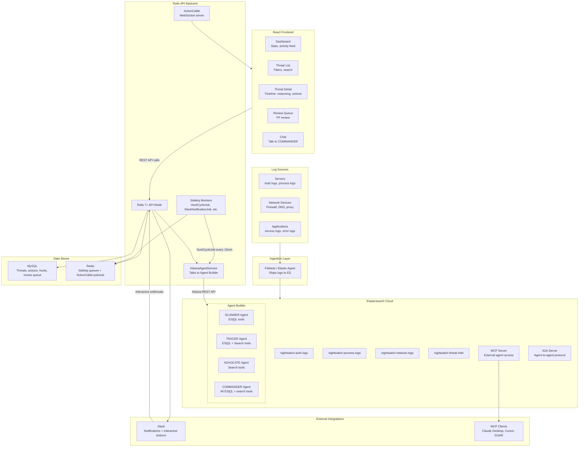

# NIGHTWATCH -- Product Specification

**Adversarial Multi-Agent Threat Hunting System**

*Elasticsearch Agent Builder Hackathon 2026*

---

## Table of Contents

1. [Real-World Security Incidents](#1-real-world-security-incidents)
2. [Problem Statement](#2-problem-statement)
3. [Threat Categories We Address](#3-threat-categories-we-address)
4. [Solution -- Product Specification](#4-solution----product-specification)
5. [High-Level Architecture](#5-high-level-architecture)

---

## 1. Real-World Security Incidents

The cybersecurity landscape is littered with catastrophic breaches where the root cause was not a lack of security tools, but a failure to **detect threats fast enough**. In every case below, the data needed to catch the attacker was already sitting in logs. Nobody connected the dots in time.

### 1.1 SolarWinds Supply Chain Attack (2020)

| Metric | Value |
|--------|-------|
| **Dwell Time** | 14 months (attackers inside the network from March 2020, discovered December 2020) |
| **Organizations Affected** | 18,000+ (including US Treasury, Homeland Security, Fortune 500 companies) |
| **Aggregate Cost** | $26 billion+ across all affected organizations |
| **Attack Vector** | Trojanized software update (Sunburst backdoor injected into SolarWinds Orion) |

**What went wrong:** Attackers performed lateral movement across thousands of networks for over a year. They used stolen credentials to move between systems, accessed email servers, and exfiltrated sensitive data. The authentication anomalies, unusual process executions, and network connections were all logged -- but no system correlated these signals across time and across hosts automatically. Security teams reviewed logs in silos: authentication logs separately from network logs separately from process execution logs. The attacker exploited this fragmentation.

**What NIGHTWATCH would have caught:** Unusual service account behavior across multiple hosts (SCANNER), credential reuse patterns inconsistent with normal admin behavior (TRACER), and the combination would have been flagged as a coordinated campaign rather than isolated anomalies.

### 1.2 Target Data Breach (2013)

| Metric | Value |
|--------|-------|
| **Dwell Time** | 7+ months (attackers active from November 2013 to detection) |
| **Records Stolen** | 40 million credit/debit card numbers + 70 million customer records |
| **Total Cost** | $202 million (including $18.5 million multi-state settlement) |
| **Attack Vector** | Compromised HVAC vendor credentials, lateral movement to POS systems |

**What went wrong:** This is the most damning case for alert fatigue. Target's FireEye security system **actually detected the malware** and fired alerts. The alerts were real. They were accurate. But they were buried in a flood of thousands of other alerts that analysts couldn't triage fast enough. The team saw the alerts -- and did nothing, because they couldn't distinguish them from the noise.

**What NIGHTWATCH would have caught:** The SCANNER agent would have flagged the initial credential compromise from the HVAC vendor. The TRACER agent would have traced the lateral movement from the HVAC network segment to the POS systems -- a path that should never exist. The ADVOCATE agent would have confirmed this was anomalous (no legitimate business reason for HVAC credentials to touch POS systems). The COMMANDER would have escalated with HIGH confidence before a single card was exfiltrated.

### 1.3 Equifax Data Breach (2017)

| Metric | Value |
|--------|-------|
| **Dwell Time** | 76 days (May 13 to July 29, 2017) |
| **Records Stolen** | 147 million Americans' personal data (SSN, birth dates, addresses) |
| **Total Cost** | $700 million settlement + $1.4 billion in security upgrades |
| **Attack Vector** | Unpatched Apache Struts vulnerability (CVE-2017-5638) |

**What went wrong:** Attackers exploited a known, publicly disclosed vulnerability that had a patch available for two months. After gaining initial access, they moved laterally across 48 databases over 76 days, running approximately 9,000 queries to extract data. The SSL certificate used for inspecting encrypted traffic had expired 19 months earlier, meaning the security team was effectively blind to encrypted exfiltration. Logs existed for every lateral movement and every database query -- but nobody was correlating them.

**What NIGHTWATCH would have caught:** 9,000 database queries from a single compromised entry point over 76 days would trigger the TRACER's lateral movement detection within the first day. The volume of data being staged and exfiltrated would trigger the data exfiltration detector. The ADVOCATE might challenge individual queries as legitimate, but the pattern across 48 databases would override any single exception.

### 1.4 Colonial Pipeline Ransomware (2021)

| Metric | Value |
|--------|-------|
| **Dwell Time** | Attackers had access for an unknown period before deploying ransomware |
| **Operational Impact** | 5-day shutdown of the largest fuel pipeline in the US (5,500 miles) |
| **Ransom Paid** | $4.4 million (75 Bitcoin) |
| **Attack Vector** | Compromised VPN credential (legacy account, no multi-factor authentication) |

**What went wrong:** A single stolen VPN password gave the DarkSide ransomware group access to Colonial Pipeline's network. The credential belonged to a VPN account that was no longer in active use but had never been deactivated. There was no multi-factor authentication. Once inside, the attackers had free rein to move laterally until they deployed ransomware. The authentication log showing a dormant account suddenly becoming active from a new IP was the signal -- but nobody was watching.

**What NIGHTWATCH would have caught:** SCANNER would flag a dormant account authenticating from a new IP. TRACER would trace the subsequent lateral movement. COMMANDER would escalate immediately -- a dormant account suddenly active and moving laterally is a textbook compromise indicator with near-zero false positive probability. The ADVOCATE would have no legitimate explanation to offer.

### 1.5 MOVEit Transfer Attacks (2023)

| Metric | Value |
|--------|-------|
| **Organizations Affected** | 2,500+ organizations worldwide |
| **Individuals Affected** | 84+ million people |
| **Estimated Total Cost** | $10 billion+ across all victims |
| **Attack Vector** | Zero-day SQL injection in MOVEit Transfer file sharing software |

**What went wrong:** The Clop ransomware gang exploited a zero-day vulnerability in Progress Software's MOVEit Transfer application. They mass-exploited hundreds of organizations simultaneously, exfiltrating data before anyone understood the scope. Each organization saw unusual file transfer activity in their logs, but because MOVEit is a file transfer tool, large file movements didn't immediately look suspicious in isolation. The anomaly was in the pattern: simultaneous unusual activity across the same software component, at unusual times, with unusual destination endpoints.

**What NIGHTWATCH would have caught:** Anomalous file transfer volumes at unusual times (SCANNER), connections to previously unseen external endpoints (TRACER), and the combination of both patterns would have been flagged as exfiltration -- not normal file sharing.

### 1.6 Industry Statistics -- The Numbers That Define The Crisis

Based on the IBM Cost of a Data Breach Report 2024/2025 and industry research:

| Statistic | Value | Source |
|-----------|-------|--------|
| Average time to **identify** a breach | **194 days** | IBM Cost of a Data Breach 2024 |
| Average time to **contain** after identification | **68 days** | IBM Cost of a Data Breach 2024 |
| Average total cost of a data breach | **$4.88 million** | IBM Cost of a Data Breach 2024 |
| Breaches discovered by the **victim's own team** | **33%** | IBM / Mandiant |
| Breaches discovered by **third parties or the attacker** | **67%** | IBM / Mandiant |
| Average SOC alerts received per day (mid-size org) | **11,000+** | Ponemon Institute |
| SOC analyst time spent on **false positives** | **45%** | Ponemon Institute |
| Security teams that report **alert fatigue** | **75%** | ESG Research |
| Average cost saved with breach lifecycle **under 200 days** | **$1.02 million** less than breaches over 200 days | IBM Cost of a Data Breach 2024 |

The math is simple: **every day a breach goes undetected costs real money.** Organizations that detect and contain breaches in under 200 days save over $1 million compared to those that take longer. The tools to detect breaches faster exist -- the problem is that humans can't process 11,000 alerts per day and correlate signals across disparate log sources simultaneously.

---

## 2. Problem Statement

### The Core Failure: Nobody Is Connecting The Dots

Every major breach in the last decade shares the same root cause: **the signals were in the logs, but no system correlated them fast enough.**

Security Operations Centers (SOCs) today face a compounding crisis:

**Alert Fatigue Is Killing Detection.**
The average SOC receives 11,000+ alerts per day. Analysts can realistically triage 20-50 per hour. That means over 95% of alerts are never investigated. Attackers know this. They design campaigns that generate low-severity individual signals that only become dangerous when correlated together -- exactly the kind of signals that get lost in the noise.

**Log Silos Prevent Correlation.**
Authentication logs sit in one index. Process execution logs sit in another. Network telemetry sits in a third. Threat intelligence sits in a fourth. A sophisticated attack touches ALL of these data sources, but no existing tool automatically correlates signals across them in real-time. Analysts must manually pivot between data sources, construct queries, and mentally hold the investigation state. This takes hours or days per incident.

**Single-Pipeline Detection Creates Blind Spots.**
Traditional SIEM tools use a single detection pipeline: Event -> Rule -> Alert. This creates two failure modes:
1. **Rules are too broad** -> floods of false positives -> alert fatigue -> real threats get ignored
2. **Rules are too narrow** -> sophisticated attacks that don't match known patterns slip through

There is no reasoning layer that can dynamically adjust its investigation based on what it finds, challenge its own conclusions, or synthesize findings from multiple angles simultaneously.

**The Cost of Delay Is Measured In Millions.**
With a 194-day average detection time and $4.88 million average breach cost, the ROI of faster detection is clear. Reducing detection time from months to minutes doesn't just save money -- it can prevent the breach from escalating entirely.

### Hackathon Problem Statement

> **How might we build an AI-powered system that automatically hunts for sophisticated security threats across multiple data sources, correlates disparate signals into coherent attack narratives, challenges its own findings to reduce false positives, and takes reliable automated action -- all while keeping humans in the loop for transparency and override?**

This is the problem NIGHTWATCH solves.

---

## 3. Threat Categories We Address

NIGHTWATCH detects threats across the four phases of an Advanced Persistent Threat (APT) attack chain, mapped to the MITRE ATT&CK framework.

### 3.1 Initial Compromise

The attacker's first foothold in the network.

| Threat Pattern | Detection Method | MITRE ATT&CK |
|----------------|-----------------|---------------|
| Brute force / credential stuffing | Spike in failed logins from single source across multiple accounts | T1110 |
| Phishing payload execution | Office application (Word, Excel) spawning command-line interpreters (PowerShell, cmd) | T1566.001 |
| Stolen credential usage | Authentication from new IP/geo for a known user, especially dormant accounts | T1078 |
| Malicious script execution | Encoded PowerShell commands, unusual script interpreters launched by unexpected parent processes | T1059 |

**ES|QL signals:** Failed login volume by source IP over time windows, process parent-child relationship anomalies, new source IP authentication for established users.

### 3.2 Lateral Movement

The attacker spreading across the network from the initial foothold.

| Threat Pattern | Detection Method | MITRE ATT&CK |
|----------------|-----------------|---------------|
| RDP abuse | Single user authenticating to multiple hosts in rapid succession | T1021.001 |
| SMB pivoting | Connections to admin shares (C$, ADMIN$) from non-admin workstations | T1021.002 |
| Credential reuse | Same credential used from multiple source hosts within a short time window | T1078 |
| Pass-the-hash / Pass-the-ticket | Authentication events without corresponding interactive logon | T1550 |

**ES|QL signals:** Distinct host count per user per time window, admin share access from unexpected sources, authentication graph analysis (which hosts touched which other hosts).

### 3.3 Privilege Escalation

The attacker gaining higher-level permissions.

| Threat Pattern | Detection Method | MITRE ATT&CK |
|----------------|-----------------|---------------|
| Credential dumping (Mimikatz) | Known tool signatures in process command lines, or renamed binaries with suspicious behavior | T1003 |
| Token manipulation | Process creation with escalated privileges from non-privileged parent | T1134 |
| UAC bypass | Auto-elevated processes spawning unexpected children | T1548.002 |
| Service abuse | New services created or existing services modified to run attacker payloads | T1543.003 |

**ES|QL signals:** Process name/hash anomalies, privilege level changes in process trees, new service installations correlated with lateral movement timelines.

### 3.4 Data Exfiltration

The attacker stealing data from the network.

| Threat Pattern | Detection Method | MITRE ATT&CK |
|----------------|-----------------|---------------|
| DNS tunneling | Abnormally high DNS query volume or unusually long DNS query strings | T1048.003 |
| Large file transfers | Unusual outbound data volume from internal hosts, especially to new external IPs | T1048 |
| Data staging | Large file creation in temp directories on hosts that don't normally stage data | T1074 |
| Encrypted exfiltration | Outbound HTTPS connections to uncategorized domains with high data volume | T1048.001 |

**ES|QL signals:** Outbound bytes per host per time window, DNS query length and frequency analysis, new external destination IPs not seen in baseline period.

### Threat Coverage Summary

```
Attack Chain:   Initial Compromise  -->  Lateral Movement  -->  Privilege Escalation  -->  Data Exfiltration
                      |                       |                        |                        |
SCANNER:       Detects entry point    Flags multi-host auth    Spots credential dumps    Catches DNS tunneling
TRACER:         Traces first pivot     Maps full movement path  Links escalation to user  Tracks data staging
ADVOCATE:       Checks if legitimate   Checks admin patterns    Checks maintenance ops    Checks normal transfers
COMMANDER:      Scores confidence      Builds attack narrative  Triggers Rails actions    Final containment call
```

---

## 4. Solution -- Product Specification

### 4.1 Product Overview

NIGHTWATCH is an adversarial multi-agent threat hunting system built on Elasticsearch Agent Builder. It deploys four specialized AI agents that independently hunt for threats across security log data, debate their findings, and take automated response actions -- all while maintaining full transparency and human oversight.

**What makes NIGHTWATCH different from existing security tools:**

| Capability | Traditional SIEM | NIGHTWATCH |
|-----------|-----------------|------------|
| Detection model | Static rules (Event -> Rule -> Alert) | LLM-powered multi-step reasoning |
| Correlation | Manual analyst work across data silos | Automatic cross-source correlation via ES|QL |
| False positive handling | Analyst manually dismisses | Adversarial agent actively challenges findings |
| Response | Human initiates all actions | Automated Rails actions with human override |
| Transparency | Alert with raw data dump | Full reasoning chain showing why each decision was made |
| Integration | Closed vendor ecosystem | Open via MCP + A2A protocols |

### 4.2 Two Interaction Modes

#### Mode 1: PUSH -- Automated Detection and Notification (Primary, ~80% of usage)

This is the core loop. Fully automated, runs continuously.

1. **Sidekiq-Cron** triggers a hunt cycle every 15 minutes
2. **Rails backend** sends a hunt request to the COMMANDER agent via Kibana API
3. **COMMANDER** orchestrates the other three agents:
   - SCANNER scans for initial compromise and exfiltration indicators
   - TRACER traces lateral movement and privilege escalation
   - ADVOCATE challenges findings against known exception patterns
4. **COMMANDER** synthesizes all findings into a threat assessment with a confidence score
5. **Rails backend** receives the assessment, creates a Threat record in MySQL
6. Based on confidence level:
   - **HIGH (70-100%):** Slack notification sent immediately + Rails executes response actions directly (simulate host isolation, create ticket)
   - **MEDIUM (40-69%):** Added to Review Queue on dashboard, no Slack alert
   - **LOW (0-39%):** Logged for audit trail, no notification
7. **Analyst** receives Slack message with: threat description, confidence score, affected assets, and a link to the full investigation on the NIGHTWATCH dashboard
8. **Analyst** clicks link, sees the complete agent reasoning chain, and can Acknowledge, Confirm, Mark as False Positive, or Escalate

#### Mode 2: PULL -- Analyst-Initiated Investigation (Secondary, ~20% of usage)

For ad-hoc investigation when an analyst has a hunch or needs to dig deeper.

1. **Analyst** opens the NIGHTWATCH dashboard Chat page
2. Types a question: *"Investigate user john.doe over the last 48 hours"* or *"Were there any suspicious RDP connections to the database servers this week?"*
3. **Rails backend** forwards the message to the COMMANDER agent via Kibana API
4. **COMMANDER** uses its tools to query Elasticsearch and returns a synthesized response
5. Response is streamed back to the dashboard via ActionCable (WebSocket)
6. If the investigation reveals a threat, the analyst can promote it to a formal Threat record with one click

### 4.3 The Four-Agent Architecture

#### SCANNER -- Initial Compromise and Exfiltration Detection

- **Role:** The first line of detection. Scans broadly across all log sources for indicators of compromise at the entry and exit points of an attack.
- **Tools:** Custom ES|QL tools (brute force detector, suspicious process chain detector, anomalous DNS detector, data transfer volume analyzer)
- **Personality:** Aggressive detector. Casts a wide net. Prefers to flag something suspicious and let others validate, rather than miss a real threat.
- **Output:** List of suspicious events with individual confidence scores and evidence.

#### TRACER -- Lateral Movement and Privilege Escalation Tracer

- **Role:** The investigator. Takes SCANNER's findings and traces the attack path through the network. Connects isolated events into an attack chain.
- **Tools:** Custom ES|QL tools (lateral movement tracker, privilege escalation scanner) + Index Search tools (historical incident patterns)
- **Personality:** Methodical and thorough. Follows the trail wherever it leads. Maps the complete attack path across hosts and users.
- **Output:** Attack chain narrative with timeline, affected assets, and movement path.

#### ADVOCATE -- Devil's Advocate (False Positive Challenger)

- **Role:** The skeptic. Actively tries to disprove the findings of SCANNER and TRACER. Checks findings against known legitimate patterns, exception lists, and business context.
- **Tools:** Index Search tools (exception patterns index, threat intel index, asset inventory)
- **Personality:** Contrarian by design. Looks for reasons why a finding might be benign. "This user is an IT admin, multi-host RDP is expected." "This process runs as part of scheduled maintenance every Tuesday at 2 AM."
- **Output:** Challenge report: which findings it can explain as legitimate, which it cannot, and why.

#### COMMANDER -- Arbiter and Response Orchestrator

- **Role:** The decision-maker. Receives all findings and challenges, resolves disagreements, assigns final confidence scores, and triggers response actions.
- **Tools:** All ES|QL and search tools for ad-hoc investigation (response actions are executed by Rails after parsing COMMANDER's JSON output)
- **Personality:** Balanced and decisive. Weighs evidence from all agents. Explains every decision transparently.
- **Decision Framework:**
  - SCANNER + TRACER agree, ADVOCATE cannot explain -> **HIGH confidence** -> auto-respond
  - SCANNER + TRACER agree, ADVOCATE raises valid partial challenge -> **MEDIUM confidence** -> add to review queue
  - Agents disagree or ADVOCATE fully explains -> **LOW confidence** -> log only
- **Output:** Final threat assessment with confidence score, attack narrative, and response actions taken/recommended.

### 4.4 The Adversarial Reasoning Loop

This is the key differentiator. Here is a concrete example of how the agents debate:

```
SCANNER: "Found 47 failed login attempts from IP 203.0.113.42 targeting 12
           different user accounts in a 3-minute window. This matches brute
           force pattern T1110. Confidence: 88%."

TRACER:   "Traced post-authentication activity. After the 47 failures, user
           'svc_backup' successfully authenticated from the same IP. Within
           the next 2 hours, svc_backup authenticated to 4 additional hosts
           via RDP: WS-042, WS-107, SRV-003, FS-001. Normal RDP usage for
           this account is 0 hosts/day. Confidence: 91%."

ADVOCATE: "CHALLENGE: IP 203.0.113.42 is registered to our VPN gateway
           provider. The failed logins may be VPN reconnection attempts.
           However, I CANNOT explain why svc_backup -- a service account --
           is initiating interactive RDP sessions to workstations. Service
           accounts do not use RDP. The lateral movement finding stands."

COMMANDER: "VERDICT: HIGH confidence (92%). The ADVOCATE's VPN challenge is
            noted for the initial brute force, reducing that component's
            weight. However, the lateral movement via a service account using
            RDP is unexplainable by any legitimate pattern. Combined
            confidence remains HIGH.

            ACTIONS TRIGGERED:
            1. Rails action: Disable svc_backup account (simulated)
            2. Rails action: Isolate WS-042, WS-107 (simulated)
            3. Slack alert sent to #security-ops
            4. Incident ticket INC-2026-0447 created

            RECOMMENDED FOLLOW-UP: Investigate all systems svc_backup has
            accessed in the past 30 days for signs of data staging."
```

This reasoning chain is stored in the Threat record and displayed in full on the dashboard. The analyst can see exactly why the system made each decision.

### 4.5 Automated Response via Rails

When the COMMANDER returns a HIGH confidence verdict, the Rails backend parses the JSON response and executes response actions directly -- no Elastic Workflows required. Rails is already the orchestrator that initiated the hunt, so it handles all downstream actions after receiving COMMANDER's structured output.

| Action | Trigger | Implementation | Reversible? |
|--------|---------|----------------|-------------|
| **isolate-host** | HIGH confidence + lateral movement detected | Rails calls a simulated network management API (or logs the action for demo) | Yes (analyst can un-isolate via dashboard) |
| **disable-account** | HIGH confidence + credential compromise detected | Rails calls a simulated account management API | Yes |
| **create-incident-ticket** | Any HIGH confidence threat | Rails creates a Threat record directly in MySQL | N/A |
| **slack-alert** | Confidence >= 70% | Rails `SlackNotificationJob` sends Block Kit formatted message via `slack-ruby-client` | N/A |

All automated actions are logged in the `threat_actions` audit trail with `performed_by: "system"` and the specific action that was executed.

### 4.6 Human-in-the-Loop: The False Positive Review System

Nothing is ever silently discarded. The false positive system requires **dual confirmation**:

**Step 1: Analyst marks a threat as false positive**
- Status changes to `false_positive_pending` (NOT `false_positive_confirmed`)
- Analyst must provide a reason/notes explaining why
- A Review Queue item is created automatically
- The threat remains fully visible and auditable

**Step 2: Senior analyst reviews the false positive**
- Review Queue page shows all pending FP reviews
- Senior analyst sees: original threat data, agent reasoning, the analyst's FP rationale
- Senior analyst can:
  - **Confirm FP:** Status becomes `false_positive_confirmed`. An Exception Pattern is created in Elasticsearch so the ADVOCATE agent can reference it in future hunts ("this pattern was previously confirmed as benign in context X").
  - **Reject FP:** Status reverts to `investigating`. A Slack notification is sent to re-alert the team.

**Step 3: Continuous learning**
- Confirmed FP patterns are stored in the `nightwatch-threat-intel` index as exception patterns
- The ADVOCATE agent references these exceptions in future hunts
- A daily Sidekiq job (`FalsePositiveAnalysisJob`) analyzes FP patterns to identify systemic issues

### 4.7 Slack Notification Format

Every HIGH confidence threat generates a Slack notification:

```
-----------------------------------------------------
NIGHTWATCH THREAT ALERT
Severity: HIGH  |  Confidence: 87%
-----------------------------------------------------

Lateral Movement Chain Detected

User "john.doe" authenticated to 5 hosts (WS-042,
WS-107, SRV-003, SRV-004, FS-001) within 2 hours
using RDP. This follows a suspicious PowerShell
execution from an Office macro on WS-042 detected
yesterday.

Attack Phase: Lateral Movement (MITRE T1021.001)
Affected Assets: WS-042, WS-107, SRV-003, FS-001
Detected: 2026-02-09 14:23 UTC

Agent Consensus:
  SCANNER: Initial compromise confirmed
  TRACER: Lateral path mapped across 5 hosts
  ADVOCATE: Challenged (john.doe is IT admin)
            -- overridden by credential dump evidence
  COMMANDER: HIGH confidence, auto-response triggered

Auto-Actions Taken:
  Host WS-042 network isolated
  Incident ticket INC-2026-0892 created

[ View Full Investigation ]  [ Acknowledge ]  [ Mark False Positive ]
-----------------------------------------------------
```

Clicking **"View Full Investigation"** opens the NIGHTWATCH dashboard at `/threats/:id` with the complete investigation data.

Clicking **"Acknowledge"** or **"Mark False Positive"** sends a Slack interactive message payload to the Rails backend webhook, which processes the action via Sidekiq.

### 4.8 Dashboard Pages

#### Page 1: Dashboard Home (`/`)
- Threats detected today (count by severity)
- Active hunt cycle status
- Average confidence score trend (chart)
- Threats by severity breakdown (pie/bar chart)
- Recent activity feed (latest threats + analyst actions)
- Pending review count badge
- Agent uptime status indicators

#### Page 2: Threat List (`/threats`)
- Paginated, filterable, searchable table of all threats
- Columns: ID, Title, Severity, Confidence, Status, Attack Phase, Affected Assets, Detected At
- Filters: Status, Severity, Confidence range, Date range, Asset name, Free text search
- Click any row to open Threat Detail

#### Page 3: Threat Detail (`/threats/:id`) -- The Core Page
Five sections:

- **Section A -- Summary Card:** Title, severity badge, confidence score (large), current status, attack phase, MITRE technique IDs, action buttons (Acknowledge, Investigate, Confirm, Mark False Positive, Escalate)
- **Section B -- Attack Chain Timeline:** Visual chronological timeline of events in the attack. Each event shows timestamp, description, which agent found it, and raw evidence. Events are connected with lines showing the progression of the attack.
- **Section C -- Agent Reasoning Panel:** The full "debate" -- what each of the four agents said, including the ADVOCATE's challenges and the COMMANDER's final reasoning. This is the demo differentiator.
- **Section D -- Affected Assets:** Table of all hosts, users, and accounts involved, with their role in the attack chain.
- **Section E -- Actions Log:** Chronological audit trail of every action taken (system and human) with timestamps and actor.

#### Page 4: Review Queue (`/review`)
- List of threats marked as false positive pending senior review
- Each item shows: threat summary, who marked it as FP, their reasoning, original confidence score
- Senior analyst can: Confirm FP (creates exception), Reject FP (re-escalates), or Add Notes

#### Page 5: Chat (`/chat`)
- Chat interface to talk to the COMMANDER agent directly
- Supports natural language queries about network activity
- Responses streamed in real-time via ActionCable WebSocket
- Can promote chat findings to formal Threat records

#### Page 6: Hunt History (`/hunts`)
- Log of all automated (Sidekiq-Cron) and manual hunt cycles
- Each entry shows: trigger type, start/end time, threats found count, agent summary
- Click to see full hunt detail with all agent activity

### 4.9 MCP Server Integration

NIGHTWATCH agents are exposed via the Elastic Agent Builder MCP (Model Context Protocol) server. This means:

- External LLM clients (Claude Desktop, Cursor, custom applications) can invoke NIGHTWATCH threat hunting directly
- A security analyst using Claude can say: *"Ask NIGHTWATCH to investigate suspicious activity on the database servers"* and Claude will call the NIGHTWATCH agent via MCP
- Third-party SOAR platforms can integrate with NIGHTWATCH agents programmatically
- The MCP server handles authentication via API keys

### 4.10 A2A (Agent-to-Agent) Integration

The A2A server enables structured communication between NIGHTWATCH agents and external agent systems:

- **Agent Card Endpoint:** `GET /api/agent_builder/a2a/{agentId}.json` returns metadata about each NIGHTWATCH agent (capabilities, tools, description)
- **A2A Protocol Endpoint:** `POST /api/agent_builder/a2a/{agentId}` allows external agents to send tasks to NIGHTWATCH agents
- External incident response systems can delegate investigation tasks to NIGHTWATCH
- API key authentication required for all A2A communication

---

## 5. High-Level Architecture

### 5.1 System Architecture Diagram



### 5.2 Component Descriptions

| Component | Technology | Responsibility |
|-----------|-----------|----------------|
| **Log Sources** | Servers, network devices, applications | Generate raw security event data |
| **Filebeat / Elastic Agent** | Elastic Beats | Ship logs into Elasticsearch indices in real-time |
| **Elasticsearch Cloud** | Elasticsearch 8.x | Store and index all security log data across 4 indices |
| **Agent Builder** | Elastic Agent Builder | Host the 4 custom AI agents with their tools and instructions |
| **MCP Server** | Elastic MCP protocol | Expose agents to external LLM clients and SOAR platforms |
| **A2A Server** | Elastic A2A protocol | Enable agent-to-agent communication with external systems |
| **Rails API** | Ruby on Rails 7+ (API mode) | REST API, business logic, orchestration layer between frontend and Elasticsearch |
| **KibanaAgentService** | Ruby service class | Handles all communication with Agent Builder via Kibana REST API |
| **Sidekiq** | Sidekiq + Redis | Background job processing: scheduled hunts, Slack delivery, FP analysis |
| **ActionCable** | Rails ActionCable | WebSocket server pushing real-time updates to React frontend |
| **MySQL** | MySQL 8.x | Persistent storage for threats, actions, hunt cycles, review queue, exceptions |
| **Redis** | Redis 7.x | Sidekiq job queues + ActionCable pub/sub adapter |
| **React Frontend** | React + TypeScript + Tailwind | Dashboard UI with 6 pages for threat management |
| **Slack** | Slack Block Kit API | Notification delivery + interactive message buttons |

### 5.3 Tech Stack Summary

| Layer | Technology | Version |
|-------|-----------|---------|
| Frontend Framework | React + TypeScript | 18.x |
| Frontend Styling | Tailwind CSS | 3.x |
| Frontend Charts | Recharts | 2.x |
| Frontend Real-time | ActionCable JS client | -- |
| Backend Framework | Ruby on Rails (API mode) | 7.x |
| Background Jobs | Sidekiq + Sidekiq-Cron | 7.x |
| WebSocket | ActionCable (built into Rails) | -- |
| Database | MySQL | 8.x |
| Cache / Queue | Redis | 7.x |
| Search / Logs | Elasticsearch Cloud | 8.x |
| Agent Engine | Elastic Agent Builder | Latest |
| Slack Integration | slack-ruby-client gem | -- |
| ES Client | elasticsearch-ruby gem | -- |
| Kibana Client | Faraday HTTP client | -- |

### 5.4 Data Flow -- Push Mode (Automated Detection)

```
1. Sidekiq-Cron fires HuntCycleJob every 15 minutes
2. HuntCycleJob creates a HuntCycle record (status: running) in MySQL
3. HuntCycleJob calls KibanaAgentService.start_hunt()
4. KibanaAgentService sends POST to Kibana API -> COMMANDER agent
5. COMMANDER orchestrates SCANNER, TRACER, ADVOCATE via Agent Builder
6. Agents query Elasticsearch indices using ES|QL tools
7. COMMANDER returns threat assessment with confidence scores
8. KibanaAgentService parses the response
9. ThreatBuilderService creates Threat record(s) in MySQL
10. For HIGH confidence: Rails executes response actions (simulate isolation, disable account)
11. For HIGH confidence: SlackNotificationJob enqueued
12. ActionCable broadcasts new threat to ThreatsChannel
13. React dashboard updates in real-time
14. Slack message delivered to #security-ops channel
15. Analyst clicks Slack link -> opens /threats/:id on dashboard
```

### 5.5 Data Flow -- Pull Mode (Analyst Query)

```
1. Analyst types question in Chat page
2. React sends POST /api/v1/chat to Rails
3. Rails creates ChatMessage record in MySQL
4. KibanaAgentService.chat(message) sends to COMMANDER agent
5. AgentResponsePollerJob polls for agent completion
6. Agent response received and parsed
7. ChatMessage (role: agent) created in MySQL
8. ActionCable broadcasts response to ChatChannel
9. React Chat page displays agent response in real-time
10. If threat found: analyst clicks "Create Threat" button
11. Rails creates Threat record from chat findings
```

